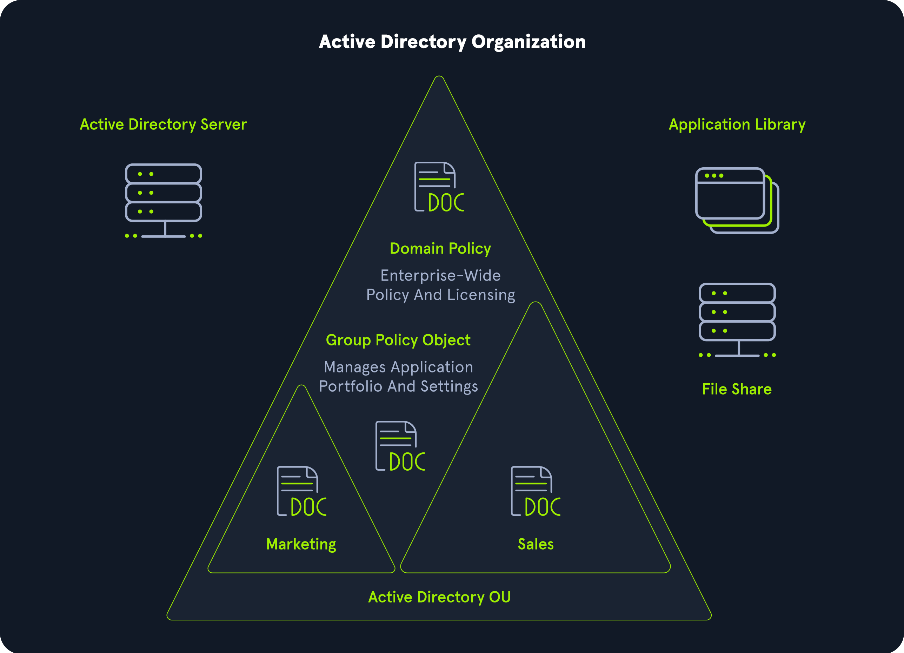

## Introduction to Active Directory

- Tier 0
- Fundamental 
- General
- 16 Sections
- 10 cubes
- 7 hours


## Why Active Directory
Active Directory (AD) is a directory service for Windows network environments. It is a distributed, hierarchical structure 
that allows for centralized management of an organization's resources, including users, computers, groups, network devices,
file shares, group policies, devices, and trusts. AD provides authentication and authorization functions within a Windows domain environment. 
It has come under increasing attack in recent years. It is designed to be backward-compatible, and many features are arguably not
"secure by default," and it can be easily misconfigured. This weakness can be leveraged to move laterally and vertically 
within a network and gain unauthorized access. AD is essentially a sizeable read-only database accessible to all users within the domain, 
regardless of their privilege level. A basic AD user account with no added privileges can enumerate most objects within AD. 
This fact makes it extremely important to properly secure an AD implementation because ANY user account, 
regardless of their privilege level, can be used to enumerate the domain and hunt for misconfigurations and flaws thoroughly. Also, multiple attacks can be performed with only a standard domain user account, showing the importance of a defense-in-depth strategy and careful planning focusing on security and hardening AD, network segmentation, and least privilege. 
One example is the [noPac attack](https://www.secureworks.com/blog/nopac-a-tale-of-two-vulnerabilities-that-could-end-in-ransomware) that was first released in December of 2021.

Active Directory makes information easy to find and use for administrators and users. AD is highly scalable, supports millions 
of objects per domain, and allows the creation of additional domains as an organization grows.

### Info

- defense-in-depth strategy (Defense in depth is a strategy that leverages multiple security measures to protect an organization's assets. The thinking is that if one line of defense is compromised, additional layers exist as a backup to ensure that threats are stopped along the way.)




It is estimated that around 95% of Fortune 500 companies run Active Directory, making AD a key focus for attackers. A successful attack such as a phish that lands an attacker within the AD environment as a standard domain user would give them enough access to begin mapping out the domain and looking for avenues of attack. As security professionals, we will encounter AD environments of all sizes throughout our careers. It is essential to understand the structure and function of AD to become better informed as both an attacker and a defender.

Ransomware operators have been increasingly targeting Active Directory as a key part of their attack paths. [The Conti Ransomware](https://www.cisa.gov/sites/default/files/publications/AA21-265A-Conti_Ransomware_TLP_WHITE.pdf) which has been used in more than 400 attacks around the world has been shown to leverage recent critical Active Directory flaws such as [PrintNightmare (CVE-2021-34527)](https://msrc.microsoft.com/update-guide/vulnerability/CVE-2021-34527) and [Zerologon (CVE-2020-1472)](https://msrc.microsoft.com/update-guide/vulnerability/CVE-2020-1472) to escalate privileges and move laterally in a target network. 

Understanding the structure and function of Active Directory is the first step in a career path to find and prevent these types of flaws before attackers do. Researchers are continually finding new, extremely high-risk attacks that affect Active Directory environments that often require no more than a standard domain user to obtain complete administrative control over the entire domain. There are many great open-source tools for penetration testers to enumerate and attack Active Directory. Still, to use these most effectively, we must understand how Active Directory works to identify obvious and nuanced flaws. Tools are only as effective as their operator is knowledgeable. So let's take the time to understand the structure and function of Active Directory before moving into later modules that will focus on in-depth manual and tool-based enumeration, attacks, lateral movement, post-exploitation, and persistence.

This module will lay the foundations for starting down the path of enumerating and attacking Active Directory. We will cover, in-depth, the structure and function of AD, discuss the various AD objects, discuss user rights and privileges, tools, and processes for managing AD, and even walk through examples of setting up a small AD environment.


## History of Active Directory

LDAP, the foundation of Active Directory, was first introduced in RFCs as early as 1971. Active Directory was predated by the X.500 organizational unit concept, which was the earliest version of all directory systems created by Novell and Lotus and released in 1993 as Novell Directory Services.

Active Directory was first introduced in the mid-'90s but did not become part of the Windows operating system until the release of Windows Server 2000. Microsoft first attempted to provide directory services in 1990 with the release of Windows NT 3.0. This operating system combined features of the [LAN](https://en.wikipedia.org/wiki/LAN_Manager) Manager protocol and the [OS/2](https://en.wikipedia.org/wiki/OS/2) operating systems, which Microsoft created initially along with IBM lead by [Ed Iacobucci](https://en.wikipedia.org/wiki/Ed_Iacobucci) who also led the design of [IBM DOS](https://en.wikipedia.org/wiki/IBM_PC_DOS) and later co-founded Citrix Systems. The NT operating system evolved throughout the 90s, adapting protocols such as LDAP and Kerberos with Microsoft's proprietary elements. The first beta release of Active Directory was in 1997.

The release of Windows Server 2003 saw extended functionality and improved administration and added the **Forest** feature, which allows sysadmins to create "containers" of separate domains, users, computers, and other objects all under the same umbrella. Active [Directory Federation Services (ADFS)](https://en.wikipedia.org/wiki/Active_Directory_Federation_Services) was introduced in Server 2008 to provide Single Sign-On (SSO) to systems and applications for users on Windows Server operating systems. ADFS made it simpler and more streamlined for users to sign into applications and systems, not on their same LAN.

### Info

- LDAP :The Lightweight Directory Access Protocol (LDAP /ˈɛldæp/) is an open, vendor-neutral, industry standard application protocol for accessing and maintaining distributed directory information services over an Internet Protocol (IP) network.|st à l'origine un protocole permettant l'interrogation et la modification des services d'annuaire (il est une évolution du protocole DAP).

- ADFS :Active Directory Federation Services (AD FS), a software component developed by Microsoft, can run on Windows Server operating systems to provide users with single sign-on access to systems and applications located across organizational boundaries. |Active Directory Federation Services est un composant de Windows Server pouvant être installé sur les serveurs Windows afin de faciliter l'accès aux utilisateurs, aux systèmes et applications.

- OS/2 :OS/2 (Operating System/2) is a series of computer operating systems, initially created by Microsoft and IBM under the leadership of IBM software designer Ed Iacobucci. As a result of a feud between the two companies over how to position OS/2 relative to Microsoft's new Windows 3.1 operating environment, the two companies severed the relationship in 1992 and OS/2 development fell to IBM exclusively.

- IBM DOS : Developed by Microsoft, it was also sold by that company as MS-DOS. Both operating systems were identical or almost identical until 1993, when IBM began selling PC DOS 6.1 with new features.

- RFC :  is a publication in a series from the principal technical development and standards-setting bodies for the Internet, most prominently the Internet Engineering Task Force (IETF).

- X.500: X.500 is a series of computer networking standards covering electronic directory services. The X.500 series was developed by the Telecommunication Standardization Sector of the International Telecommunication Union (ITU-T).


ADFS enables users to access applications across organizational boundaries using a single set of credentials. ADFS uses the claims-based Access Control Authorization model, which attempts to ensure security across applications by identifying users by a set of claims related to their identity, which are packaged into a security token by the identity provider.

The release of Server 2016 brought even more changes to Active Directory, such as the ability to migrate AD environments to the cloud and additional security enhancements such as user access monitoring and Group Managed Service Accounts (gMSA). gMSA offers a more secure way to run specific automated tasks, applications, and services and is often a recommended mitigation against the infamous Kerberoasting attack.

2016 saw a more significant push towards the cloud with the release of Azure AD Connect, which was designed as a single sign-on method for users being migrated to the Microsoft Office 365 environment.


Active Directory has suffered from various misconfigurations from 2000 to the present day. New vulnerabilities are discovered regularly that affect Active Directory and other technologies that interface with AD, such as Microsoft Exchange. As security researchers continue to uncover new flaws, organizations that run Active Directory need to remain on top of patching and implementing fixes. As penetration testers, we are tasked with finding these flaws for our clients before attackers.

For this reason, we must have a solid foundation in Active Directory fundamentals and understand its structure, function, the various protocols that it uses to operate, how user rights and privileges are managed, how sysadmins administer AD and the multitude of vulnerabilities and misconfigurations that can be present in an AD environment. Managing AD is no easy task. One change/fix can introduce additional issues elsewhere. Before beginning to enumerate and then attack Active Directory, let's cover foundational concepts that will follow us throughout our infosec careers.

As said before, 95% of Fortune 500 companies run Active Directory, and Microsoft has a near-complete monopoly in the directory services space. Even though many companies are transitioning to cloud and hybrid environments, on-prem AD is not going away for many companies. If you are performing network penetration testing engagements, you can be nearly sure to encounter AD in some way on almost all of them.

This fundamental knowledge will make us better attackers and give us insight into AD that will be extremely useful when providing remediation advice to our clients. A deep understanding of AD will make peeling back the layers less daunting, and we will have the same confidence when approaching an environment with 10,000 hosts as we do with one with 20.


## Active Directory Research Over the Years

Active Directory has been a major area of focus for security researchers for the past decade or so. Starting in 2014, we began to see many of the tools and much of the research emerge, leading to the discovery of common attacks and techniques that are still used today. Below is a timeline of events highlighting the discovery of some of the most impactful attacks and flaws by incredible researchers, as well as the release of some of the most widely used tools by penetration testers until this day. While many techniques have been discovered over the years, AD (and now Azure AD) presents a vast attack surface, and new attacks are still being discovered. New tools emerge that both penetration testers and defenders must have a firm grasp of to assist organizations with the difficult but critical task of securing AD environments.
As we can see from the timeline below, critical flaws are continuously being discovered. The noPac attack was discovered in December of 2021 and is the most recent critical AD attack that has been discovered at the time of writing (January of 2022). As we continue into 2022, we will surely see new tools and attacks released and new methods for exploiting and chaining together known vulnerabilities. We must stay on top of the latest and greatest Active Directory research to best help customers secure it or secure it ourselves.

This is by no means a comprehensive list of all the excellent research and tools that have been released over the years, but this is a snapshot of many of the most consequential ones seen over the past decade. The hard work of the researchers listed in this timeline (and many others) has led to remarkable discoveries and the creation of tools that can help both penetration testers and defenders dig deep into Active Directory environments. With them, it's easier to find both obvious and obscure, high-risk flaws before attackers do.

## AD Attacks & Tools Timeline


**2021** 

The PrintNightmare vulnerability was released. This was a remote code execution flaw in the Windows Print Spooler that could be used to take over hosts in an AD environment. The Shadow Credentials attack was released which allows for low privileged users to impersonate other user and computer accounts if conditions are right, and can be used to escalate privileges in a domain. The noPac attack was released in mid-December of 2021 when much of the security world was focused on the Log4j vulnerabilities. This attack allows an attacker to gain full control over a domain from a standard domain user account if the right conditions exist.


**2020**

The ZeroLogon attack debuted late in 2020. This was a critical flaw that allowed an attacker to impersonate any unpatched domain controller in a network.


**2019**

harmj0y delivered the talk "Kerberoasting Revisited" at DerbyCon which laid out new approaches to Kerberoasting. Elad Shamir released a blog post outlining techniques for abusing resource-based constrained delegation (RBCD) in Active Directory. The company BC Security released Empire 3.0 (now version 4) which was a re-release of the PowerShell Empire framework written in Python3 with many additions and changes.


**2018**

The "Printer Bug" bug was discovered by Lee Christensen and the SpoolSample PoC tool was released which leverages this bug to coerce Windows hosts to authenticate to other machines via the MS-RPRN RPC interface. harmj0y released the Rubeus toolkit for attacking Kerberos. Late in 2018 harmj0y also released the blog "Not A Security Boundary: Breaking Forest Trusts" which presented key research on performing attacks across forest trusts. The DCShadow attack technique was also released by Vincent LE TOUX and Benjamin Delpy at the Bluehat IL 2018 conference. The Ping Castle tool was released by Vincent LE TOUX for performing security audits of Active Directory by looking for misconfigurations and other flaws that can raise the risk level of a domain and producing a report that can be used to identify ways to further harden the environment.


**2017**

The ASREPRoast technique was introduced for attacking user accounts that don't require Kerberos preauthentication. _wald0 and harmj0y delivered the pivotal talk on Active Directory ACL attacks "ACE Up the Sleeve" at Black Hat and DEF CON. harmj0y released his "A Guide to Attacking Domain Trusts" blog post on enumerating and attacking domain trusts.


**2016**

BloodHound was released as a game changing tool for visualizing attack paths in AD at DEF CON 24.


**2015**

2015 saw the release of some of the most impactful Active Directory tools of all time. The PowerShell Empire framework was released. PowerView 2.0 released as part of the (now deprecated) PowerTools repository, which was a part of the PowerShellEmpire GitHub account. The DCSync attack was first released by Benjamin Delpy and Vincent Le Toux as part of the mimikatz tool. It has since been included in other tools. The first stable release of CrackMapExec ((v1.0.0) was introduced. Sean Metcalf gave a talk at Black Hat USA about the dangers of Kerberos Unconstrained Delegation and released an excellent blog post on the topic. The Impacket toolkit was also released in 2015. This is a collection of Python tools, many of which can be used to perform Active Directory attacks. It is still actively maintained as of January 2022 and is a key part of most every penetration tester's toolkit.


**2014**

Veil-PowerView first released. This project later became part of the PowerSploit framework as the (no longer supported) PowerView.ps1 AD recon tool. The Kerberoasting attack was first presented at a conference by Tim Medin at SANS Hackfest 2014.


**2013**

The Responder tool was released by Laurent Gaffie. Responder is a tool used for poisoning LLMNR, NBT-NS, and MDNS on an Active Directory network. It can be used to obtain password hashes and also perform SMB Relay attacks (when combined with other tools) to move laterally and vertically in an AD environment. It has evolved considerably over the years and is still actively supported (with new features added) as of January 2022.


## Active Directory Strutures


Active Directory (AD) is a directory service for Windows network environments. It is a distributed, hierarchical structure that allows for centralized management of an organization's resources, including users, computers, groups, network devices and file shares, group policies, servers and workstations, and trusts. AD provides authentication and authorization functions within a Windows domain environment. A directory service, such as Active Directory Domain Services (AD DS) gives an organization ways to store directory data and make it available to both standard users and administrators on the same network. AD DS stores information such as usernames and passwords and manages the rights needed for authorized users to access this information. It was first shipped with Windows Server 2000; it has come under increasing attack in recent years. It is designed to be backward-compatible, and many features are arguably not "secure by default." It is difficult to manage properly, especially in large environments where it can be easily misconfigured.

Active Directory flaws and misconfigurations can often be used to obtain a foothold (internal access), move laterally and vertically within a network, and gain unauthorized access to protected resources such as databases, file shares, source code, and more. AD is essentially a large database accessible to all users within the domain, regardless of their privilege level. A basic AD user account with no added privileges can be used to enumerate the majority of objects contained within AD, including but not limited to:

- Domain Computers
- Domain Users
- Domain Group Information
- Organizational Units (OUs)
- Default Domain Policy
- Functional Domain Levels
- Password Policy
- Group Policy Objects (GPOs)
- Domain Trusts
- Access Control Lists (ACLs)

For this reason, we must understand how Active Directory is set up and the basics of administration before attempting to attack it. It's always easier to "break" things if we already know how to build them.

### ------------------------------------------------------------------------------------------------------------------------

Active Directory is arranged in a hierarchical tree structure, with a forest at the top containing one or more domains, which can themselves have nested subdomains. A forest is the security boundary within which all objects are under administrative control. A forest may contain multiple domains, and a domain may include further child or sub-domains. A domain is a structure within which contained objects (users, computers, and groups) are accessible. It has many built-in Organizational Units (OUs), such as Domain Controllers, Users, Computers, and new OUs can be created as required. OUs may contain objects and sub-OUs, allowing for the assignment of different group policies.


```plaintext

INLANEFREIGHT.LOCAL/
├── ADMIN.INLANEFREIGHT.LOCAL
│   ├── GPOs
│   └── OU
│       └── EMPLOYEES
│           ├── COMPUTERS
│           │   └── FILE01
│           ├── GROUPS
│           │   └── HQ Staff
│           └── USERS
│               └── barbara.jones
├── CORP.INLANEFREIGHT.LOCAL
└── DEV.INLANEFREIGHT.LOCAL

```

Here we could say that INLANEFREIGHT.LOCAL is the root domain and contains the subdomains (either child or tree root domains) ADMIN.INLANEFREIGHT.LOCAL, CORP.INLANEFREIGHT.LOCAL, and DEV.INLANEFREIGHT.LOCAL as well as the other objects that make up a domain such as users, groups, computers, and more as we will see in detail below. It is common to see multiple domains (or forests) linked together via trust relationships in organizations that perform a lot of acquisitions. It is often quicker and easier to create a trust relationship with another domain/forest than recreate all new users in the current domain. As we will see in later modules, domain trusts can introduce a slew of security issues if not appropriately administered.


