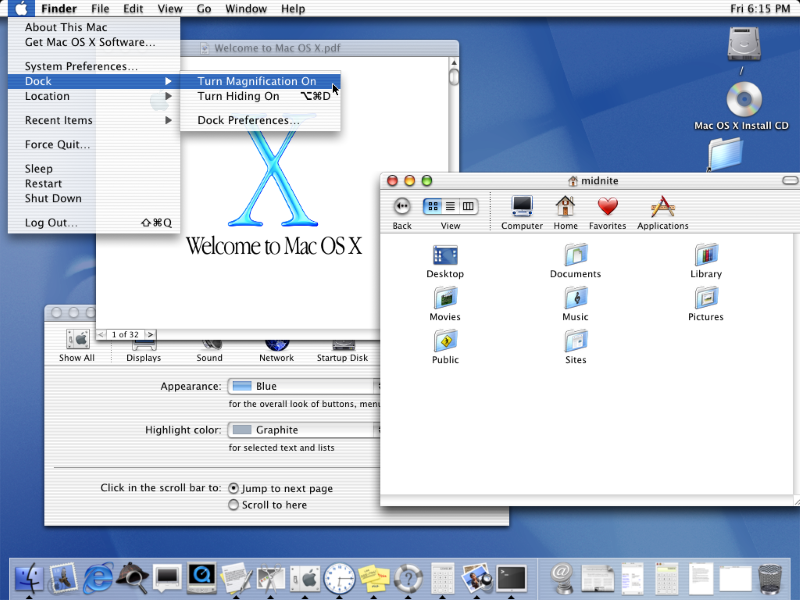
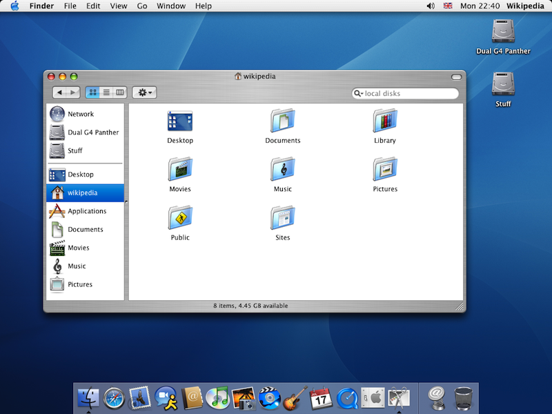
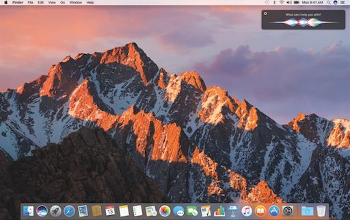
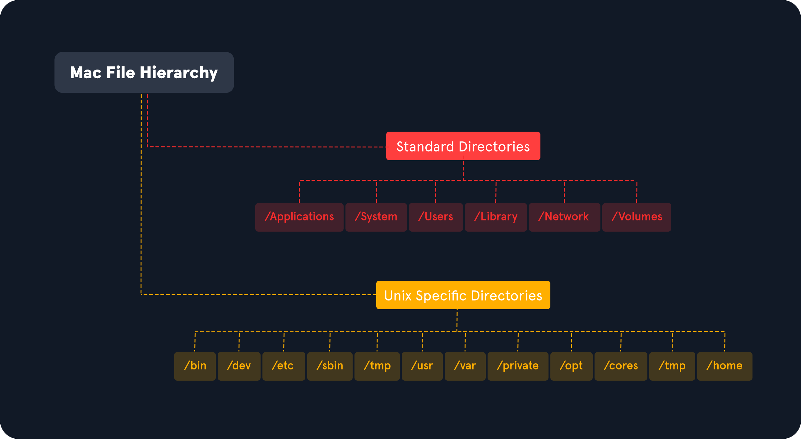
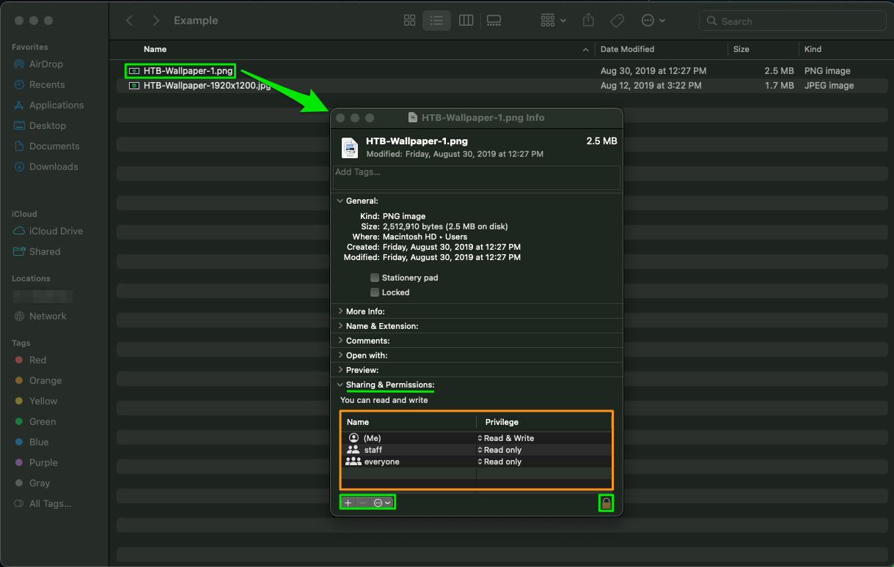
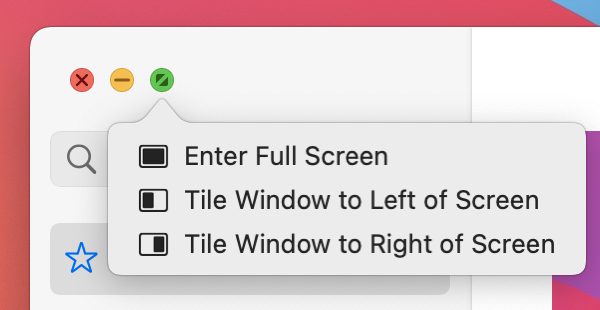

# What Is macOS?

* * *

Many have and use an Apple product in their lives every day. From your Macbook to your iPhone or iPad, there are many different revisions to the Apple OS line, but most of them are, in fact, based on macOS (originally Mac OS X). So let's answer the question, "What is macOS?"

Let's start this module by breaking down the history of macOS, its use, architecture, and core components. `macOS` is the official term for the operating system used on Apple computers. It is a widely used OS and is `second` in market use only to Windows operating systems. It can be found in the realms of daily home use, business management, graphical design, and arts.

* * *

## History Roundup

Let's take a look at the origins of macOS for a minute.

#### Timeline

## 2000-2002

This is known as the original start to OS X leading up to macOS as we know it. In the fall of 2000, Apple released a public beta code named `Kodiak` for users to test and provide feedback. After taking in those responses and making fixes, Apple released Mac OS X (10.0), named `Cheetah`, in the spring of 2001. This is the first time the world will see the new User interface Aqua. 

A few months later, Apple released OS X (10.1) named `Puma`. This iteration drastically improved system performance and began officially replacing Mac OS 9, OS X's predecessor, on all new computers shipped out.

In the Fall of 2002, the next iteration of OS X was released. OS X (10.2), named `Jaguar`, focused on user interaction improvements and introduced new applications like iChat to the world.

## 2003

OS X (10.3) named `Panther` was released in the fall of 2003. Most interesting about this release
was the fact that Apple's new web browser `Safari` replaced Internet Explorer on their hosts. Support for
integration with `Active Directory` was also added during this release.


## 2005

OS X (10.4) named `Tiger` released, bringing with it new features and new looks with Widgets and
dashboards. Up to this point, only PowerPC processors were supported for Apple products. With this release, Apple
hit a milestone by officially releasing support for the `Intel` based chipset in their hosts.


## 2007-2009

2007 was a big year for Apple. In the spring, they unveiled their new gadget that changed the world, the
`iPhone` and with it iOS, which was completely based on Mac OS X. That same year in the fall, OS X (10.5) `Leopard` was released and
introduced Apple's built-in backup system, Time Machine, along with support for 64-bit applications. At this
point, dual-booting was first introduced to the Mac line with the introduction of Boot Camp, providing support
for the Windows OS on Mac hardware.


Following Leopard in 2009, OS X (10.6) `Snow Leopard` released,
which was an incremental update over Leopard. The only real changes were the addition of the AppStore and the discontinuation of support for the PowerPC processors. From this point on, Apple moved to Intel
based processors exclusively.


## 2011-2012

OS X (10.7) `Lion` brought many successful features from iOS to their Mac OS X, like Gestures and
saved window states. Lion also saw the introduction of `iCloud` to Mac OS X, bringing
interconnected cloud storage to the Apple realm of products.


2012 brought us `Mountain Lion` (10.8),
with the main focus on bringing many of the features that were currently iOS-only into Mac OS X. 

## 2013

From this point
forward, Apple decided to stick to a yearly release cycle of Mac OS X. After over a decade of releases named after big wild
cats, Apple also decided to ditch the animal theme and move to a naming convention based off locations and landmarks
within `California.`. With a fresh new naming standard, OS X (10.9) `Mavericks`, kicks off the new release schedule and
Apple put out a statement that all future releases would be `free for upgrade` (including this one).
There were some functionality tweaks but nothing substantial under the hood.


## 2014-2015

With the release of OS X (10.10) `Yosemite`, the Handoff functionality brought exciting change to the
Apple product lines allowing users to seamlessly move any task users are working on from one Apple device to another.
The UI is moving more toward the iOS look and feel.


OS X (10.11) `El Capitan` brought more
performance changes and the ability to tile your screen with split views.


## 2016-2017

OS X is dead! Long live `macOS`. With the release of macOS (10.12) named `Sierra`, Apple
officially moved away from the "OS X" moniker to "macOS". Along with this change, Apple brought integration for
Siri, Apply Pay, and other tweaks under the hood to macOS.


macOS (10.13) `High Sierra` brought along
the switch to the `Apple File System (APFS)` and several other support functionalities under the
hood.


## 2018

macOS (10.14) `Mojave` brought significant visual enhancements with this update. `Darkmode`
was introduced to the platform, working natively with all macOS apps and many third-party ones. The ability to
have your host dynamically shift from dark mode to light mode with the time of day was also a big change. Mojave
also ported over several more iOS apps to macOS, like News, Stocks, and Home, to name a few.


## 2019

macOS (10.15) `Catalina` split iTunes into three separate apps (Apple TV, Podcasts,
and Music). This update also focused on bringing more iOS features to macOS and also allowed the use of an
iPad as a secondary display with the `Sidecar` feature.


## 2020

macOS 11 releases, named `Big Sur`, finally moved away from OS version 10 (or X) and brought big changes to the UI and functionality of the OS
as a whole. Much care was taken to improve communications channels in this revision as well. The major new feature of macOS 11 was supporting the all-new `Apple Silicon` processor while still supporting Intel processors for at least a few more years. Much of the focus of this
revision also went to bug fixes.


## 2021

macOS 12 `Monterey`. Integration improvements, dubbed `Universal Control`, were introduced
that made controlling multiple Apple devices at once much more seamless. AirPlay saw some big changes, and you
can now use a Mac as a speaker when casting to other devices. `Spatial Audio` was introduced to
Facetime, along with other features like SharePlay which, allow you to share audio, video, and even your screen
with other users over FaceTime.


## 2022

macOS 13 `Ventura` is the most recent release of macOS as of the time of writing this module. It
introduced a new window management feature called `Stage Manager`, along with other features like
`Continuity Camera`, new Apps and app updates, a facelift to the settings app, along with other
features.


* * *

Now that we know a bit about the history of macOS let's dive into the architecture of the OS itself and some of its core components.

* * *

## OS & Architecture Info

`Kernel`: [XNU](https://github.com/apple/darwin-xnu)

- The Mach kernel is the basis (along with portions from BSD) of the macOS and iOS `XNU` Kernel architecture, which handles our memory, processors, drivers, and other low-level processes.

`OS Base`: [Darwin](https://github.com/apple/darwin-xnu), a FreeBSD Derivative open-sourced by Apple.

- Darwin is the base of the macOS operating system. Apple has released Darwin for open-source use. Darwin, combined with several other components such as `Aqua`, `Finder`, and other `custom components`, make up the macOS as we know it.

As mentioned above, macOS recently shifted to mainly support Apple Silicon while still supporting Intel processors for the time being.

These points above make up the basis of macOS as an operating system. There is much more to it, but we are just trying to get an initial understanding of what macOS is for now. Next, let us address several core components within macOS.

* * *

## Core Components

`GUI`: [Aqua](https://en.wikipedia.org/wiki/Aqua_(user_interface)#References) is the basis for the Graphical interface and visual theme for macOS. As technology has advanced, so has Aqua, providing more and more support for other displays, rendering technologies, and much more. It is known for its flowy style, animations, and transparency with windows and taskbars.

`File Manager`: [Finder](https://support.apple.com/en-us/HT201732) is the component of macOS that provides the Desktop experience and File management functions within the OS. Aqua is also responsible for the launching of other applications.

`Application Sandbox`: By default, macOS and any apps within it utilize the concept of sandboxing, which restricts the application's access outside of the resources necessary for it to run. This security feature would limit the risk of a vulnerability to the application itself and prevent harm to the macOS system or other files/applications within it.

[Cocoa](https://developer.apple.com/library/archive/documentation/macOSX/Conceptual/OSX_Technology_Overview/CocoaApplicationLayer/CocoaApplicationLayer.html): Cocoa is the application management layer and API used with macOS. It is responsible for the behavior of many built-in applications within macOS. Cocoa is also a development framework made for bringing applications into the Apple ecosystem. Things like notifications, Siri, and more, function because of Cocoa.

* * *

Now that we have a general idea of what macOS is, its origins, and what it is comprised of, let's move on to explore the user interface and all it entails.

#### Questions

Answer the question(s) below
to complete this Section and earn cubes!

Cheat Sheet

\+ 1  What BSD derivative is the basis of the macOS operating system?

Submit

Hint

\+ 1  What provides the desktop experience and file management capabilities within macOS?

Submit

Hint


# Graphical User Interface

* * *

Like most common operating systems, macOS has a powerful `Graphical User Interface` (GUI). Understanding the components that make up the GUI and how we can use them is the key to efficiency while completing our tasks. Let's define a few critical components of the GUI and dive into how they can help us.

Here's a quick glance at the main components that make up macOS:

| **Component** | **Description** |
| --- | --- |
| `Apple Menu` | This is our main point of reference for critical host operations such as System Settings, locking our screen, shutting down the host, etc. |
| `Finder` | Finder is the component of macOS that provides the Desktop experience and File management functions within the OS. |
| `Spotlight` | Spotlight serves as a helper of sorts on your system. It can search the filesystem and your iCloud, perform mathematical conversions, and more. |
| `Dock` | The Dock at the bottom of your screen, by default, acts as the holder for any apps you frequently use and where your currently open apps will appear. |
| `Launchpad` | This is the application menu where you can search for and launch applications. |
| `Control Center` | Control Center is where we can manage our network settings, sound and display options, notification, and more at a glance. |

Now, let's take a look at them in detail.

* * *

## Apple Menu


From this menu, we can perform quick admin functions such as shutting down/restarting the host or accessing System Settings. If we click on `About this Mac` and then `More Info`, we can view basic information about the host, such as storage capacity, system information, and more.

* * *

## Finder


`Finder` is the macOS file manager through which we can manage and access our files. It provides:

- The initial desktop experience.
- File management.
- The menu bar at the top of your desktop.
- The sidebars within your windows.

We will go into more detail about Finder in the next section.

* * *

## Spotlight


`Spotlight` provides an indexing and searching service on your host. It can search for documents, media, emails, applications, and anything else on your local system and in connected cloud services like iCloud. Spotlight can also perform quick mathematical conversions and calculations in the search window. When connected with Siri, Spotlight can even feed you information pertaining to news and other info. To access it, click on the magnifying glass in the top right corner (Yellow arrow), and it will open a window like the one seen below. (Orange arrow) We can see a search for `.png` was run, and it returned any png formatted files that could be found on the host.

* * *

## Dock


The `Dock` provides a customizable place to store applications and folder shortcuts for us to access them when needed quickly. By default, it is located at the bottom of your desktop but can be moved to any edge that works best for you. This is where we will find quick access to Finder, Trash, and any other macOS application we pin to the Dock or even recently opened ones.

* * *

## Launchpad


`Launchpad` provides users with a quick way to access, organize, and launch applications. Any apps installed on the host in the Applications directory will appear here. We can quickly scroll through to find the app we need or start typing, and launchpad will filter based on your text, showing you relevant applications. To access Launchpad, we can pinch with five fingers on the trackpad. We can also access it by searching for it in Spotlight or even pin it to the Dock, as shown in the screenshot above.

**Tip:** To view all possible trackpad gestures, like the pinch we discussed above, we can go to \`System Settings\` and then click on \`Trackpad\` to view and practice all available gestures.

* * *

## Control Center


`Control Center` allows quick access to settings we commonly tweak, such as our audio volume, screen brightness, wireless connection settings, and other settings. We can customize the control center to fit our needs as well.

#### Questions

Answer the question(s) below
to complete this Section and earn cubes!

Cheat Sheet

\+ 1  Find the numeric version running on your machine and submit it as the answer.

Submit

Hint


# Navigating Around The OS

* * *

Navigating between files, folders, and apps in macOS isn’t particularly tricky, but knowing the right tricks can improve efficiency and make navigation effortless.

* * *

## Using Finder


As discussed in the previous section, `Finder` is the component of macOS that provides the File management functions within the OS. You can use `Finder` to find and browse files present inside your Mac.

### View Root Directory

One way to view the `root` directory is to launch the `Finder` app from the Dock, click on the `Go` Pane at the top, select `Computer` & click on `Storage`.


Another way to open the root directory is to launch the `Finder` app from Dock; enter the keyboard shortcut `Command + Shift + G`, type `/`, and hit `Go`.


You may also go up and down directories in Finder using the `Command` with the `up` and `down` arrows.

### Copy and Paste Files & Folders

Just like any other OS, you may copy/paste items in Finder with the right-click menu or the `Command + C` and `Command + V` keyboard shortcuts:


You can also move items by dragging them from one folder to another or even duplicate any item by holding the `option` key while dragging them.

### Cut and Paste (Move) Files & Folders

MacOS does not offer a direct GUI feature to cut and paste files & folders using `Finder`. But you can use the keyboard shortcut `Command + Option + V` to move the copied file directly.

1. Launch the `Finder` app from the Dock.
2. Right-click on the file or folder you want to move and select `Copy`.
3. Use `Finder` to head to the location where you want to move a file, and use the keyboard shortcut `Command + Option + V` to move the file.

Another way to move files in macOS is using the `mv` command in the `terminal`, which must be used with caution as it is an irreversible command. To do so, open a terminal from Dock & run the following command to move the `Test` folder from the Users `Document directory` into the Users `Desktop directory`.

```shell
[root@htb]/Users$ mv /Users/htb-student/Documents/Test /Users/htb-student/Desktop/Test

```

**Note:** While macOS does not allow "Cut/Paste" of files to avoid potential file loss, it does allow "Cut/Paste" of text through the right-click menu or with the "Command + X" shortcut.

### View Hidden Files and Folders

There are lots of hidden files and folders present on macOS that prevent users from accidentally deleting files used by the operating system. However, there are multiple ways to view hidden files on a Mac using the GUI and terminal.

To view hidden files and folders using the GUI:

1. Open the folder where you want to see hidden files


1. Hold down `Command + Shift + .` (full stop/period)


You may also change the default view of Finder to show hidden files, as follows:

1. Open a terminal from `Dock` & run the following commands in Terminal

```shell
[root@htb]/Users$ defaults write com.apple.Finder AppleShowAllFiles true
[root@htb]/Users$ killall Finder

```

* * *

## Using Preview Pane

The `Preview Pane` within `Finder` allows us to glance at what files and images look like before opening them. It provides instant previews of what’s in each file you highlight with additional information about the file such as `Creation Date & Time`, `Last Modified Date & Time`, `Last Opened Date & Time`, etc.

Enable `Preview Pane` inside `Finder` to look at the file preview.

1. Launch the `Finder` app from the Dock.
2. Click on the `View` Pane at the top & select `Show Preview`.

3. Now, you can click on any file and see the file's contents on the right side with additional information regarding the file.


* * *

## Finding What You Need

`Spotlight` is a `system-wide` desktop search feature of Apple's macOS and iOS operating systems, as discussed in previous sections. `Spotlight` can help you quickly find items present on your Mac.

Let's try opening a `Dictionary` in macOS using Spotlight.

1. Click on the `magnifying glass` icon at the top-right corner of the desktop or use the keyboard shortcut ( `Command + Space bar`) to open `Spotlight`.


1. Type the keyword `dictionary` inside the `Spotlight search bar` and click on the `Dictionary` app to open a Dictionary instance.


* * *

## How To Move Around Apps

Moving and switching from one app to another can be tedious, especially if there is a frequent need to split apps every few seconds. To improve efficiency while working on multiple apps, macOS provides features like `Mission Control` & `Split View`.

#### Mission Control

MacOS provides a feature named `Mission Control`, which offers a bird's-eye view of all open windows, desktop spaces, and apps, making switching between them easy.

There are multiple ways to open the `bird's-eye` view on your Mac.

1. Swipe up using three fingers on your trackpad.


1. Open the Mission Control app manually from the Launchpad.


#### Split View

By using Split View, you can split your Mac screen between two apps. It would automatically resize the screen without manually moving and resizing windows. Split View only works if you already have two or more apps running in the background.

To use Split View with apps, hover the mouse pointer over the `full-screen` button (Green Colored) on the `top-left,` and you will be presented with three options to select from:

1. `Enter Full Screen`
2. `Tile Window to Left of Screen`
3. `Tile Window to Right of Screen`


Choose `Tile Window to Left of Screen` from the menu, and the window will fill that side of the screen. Now hover the mouse pointer onto the next side of the screen and select another app to begin using both apps in split windows side by side.


* * *

Now that we are system navigation pros, the next section will give us insight into the host's filesystem structure.

#### Questions

Answer the question(s) below
to complete this Section and earn cubes!

Cheat Sheet

\+ 2  Download the above file and double click on it to unzip it. The extracted folder may appear empty, but in reality it has a hidden file with the flag. Can you find the flag?

Submit

[flag.zip](/storage/modules/157/flag.zip)


# System Hierarchy

* * *

The macOS filesystem can be looked at through several lenses. The structure mimics a standard Unix/Linux setup but also has its own context for User, Local, and System directories. This section will break them down to ensure we know where our critical files reside on the host.

**Note:** As macOS is essentially unix-based, many of the things and commands covered in the [Linux Fundamentals](/module/details/18) module also apply here and can be used with macOS, though some may use slightly difference syntax. This module will not repeat the Linux basics as covered in the [Linux Fundamentals](/module/details/18) module, but will mainly be covering macOS-specific topics, so you are advised to also go through that module to have a wholistic understanding of both macOS and Linux.

* * *

## MacOS Domains


In macOS, a file system is divided into multiple domains that separate files and resources depending on their intended usage. Domains apply `access privilege` to the files and resources in that domain, preventing unauthorized users from changing files.

| **Domain** | **Description** |
| --- | --- |
| `Local Domain` | Contains resources such as apps that are local to the current computer and shared among all computer users. |
| `System Domain` | Contains the system software installed by Apple. |
| `User Domain` | Contains resources specific to the users who log in to the system. This domain reflects the home directory of the current user at runtime. |
| `Network Domain` | Contains resources such as apps and documents that are shared among users of a local area network. |

## macOS File System Structure



### Standard Directories

#### /Applications

The `Applications` directory contains applications that users would commonly use. There are multiple `/Applications` folders, each belonging to a different domain.

| **Domain** | **Description** |
| --- | --- |
| `User Domain` | Applications that are installed and related to a particular user are saved under `/Users/username/Applications` |
| `Local Domain` | Applications which are installed by a user, installed by `Apple`, and which can be used by `all` users present in a computer are saved under `/Applications` |
| `System Domain` | Applications which are related to the system or installed by `Apple` are saved under `/System/Applications` |

#### /Users

The `Users` directory belongs to the `User Domain`. It contains user-related applications, files, and resources. Each user account has its own user folder, located under `/Users/username`. Each user has access `only` to their user directory and `cannot` access items on another user's directory.

For example, if two users, `htb-student` and `htb-dev`, are present in the system, then the `/Users` directory would consist of two directories, with each user account having its own directory.

```shell
[root@htb]/Users$ ls

htb-dev
htb-student

```

#### /Library

The `Library` directory stores custom data files for applications, caches, configurations, resources, preferences, and user data. The Local and system domain Library directories are Global in scope, while the user Library directory is specific to that user.

| **Domain** | **Description** |
| --- | --- |
| `User Domain` | Information about the applications related to the current user is stored in `/Users/username/Library` |
| `Local Domain` | Information related to an application that is shared by all the users who are using that application is stored in `/Library` directory |
| `System Domain` | Information about system applications is stored in `/System/Library` |

The `Library` directory contains some key subdirectories:

- `Library/Application Support`: Contains app-specific support files, data files & configuration files
- `Library/Caches`: Contains app-specific support files that the app can re-create easily
- `Library/Frameworks`: Stores libraries that are used, or needed, to create an application
- `Library/Preferences`: contains the application preferences (PowerManagement, SoftwareUpdate, Logging, Calendar, etc.)

#### /Network

The `Network` directory contains files that belong to the network domain. This directory contains the list of computers in the local area network.

#### /System

The `System` directory contains the system resources required by macOS to run. These files are installed by Apple and shouldn't be modified.

### Unix-Specific Directories

macOS also has some Unix-specific directories structured in a tree-like hierarchy.

#### Directory Tree


| **Directory** | **Description** |
| --- | --- |
| `/` | Is the root filesystem and contains everything the operating system needs to complete the boot cycle. Any volumes or filesystems can be found here. Think of `/` as our bucket containing everything the host needs and storing them in subdirectories like `/etc`, `/home`, and `/usr`. |
| `/bin` | Is our main storage point for binaries. |
| `/dev` | Maintains our device-id files that enable the use of hardware devices attached to the system. |
| `/etc` | `/etc` contains our system and application configuration files. |
| `/sbin` | Contains all the essential and common administrative binaries we need to keep our systems running smoothly. |
| `/tmp` | The `/tmp` directory is used by the operating system to store temporary files that do not need to be persistent. The files in this directory are wiped away at each reboot. |
| `/usr` | This is one of the largest directories on our host. It contains all of the libraries we may need, applications such as FTP, SSH, and even vim. |
| `/var` | This Is where we store our system log files, sources for our web servers, backups, and more. |
| `/private` | Stores critical system files and caches required to operate. They are hidden in the /Private directory to ensure the standard user does not modify them. |
| `/opt` | This is our storage point for any third-party applications or packages we install. |
| `/cores` | Contains Core Dumps stored by MacOS that are intended for developers to troubleshoot any issues that arise. |
| `/home` | Each user on the system has a subdirectory here for storage. Our user Desktop, Downloads, and Documents folders can be found here. |

This was not an exhaustive list of every directory or subdirectory on our hosts. We recommend if you run into a specific folder you do not quite understand the purpose of, check the man page or Google what that specific directory is for. The `man hier` command is also helpful for getting an initial understanding of the standard Unix folder structure.

* * *

Now that we have an idea of how our macOS host filesystem is structured let's look at file and directory permissions so we understand who can access what files within the filesystem.

#### Questions

Answer the question(s) below
to complete this Section and earn cubes!

Cheat Sheet

\+ 1  Where are the Applications related to the system stored at?

Submit


# File and Directory Permissions

* * *

MacOS, being based on a Unix predecessor, makes file and folder permissions easy for us to grasp and manage. Before we dive into viewing and governing permissions in macOS, we will refresh our knowledge of the Unix/Linux permissions and how they are applied.

* * *

## \*NIX Permissions Primer

Within the file system structure, every object on the host belongs to a specific user or group. When we create new files or directories, they belong to the user who initiated their creation (User Owner), and our primary group will also be the group owner of the file. If a directory has specific permissions set for group ownership, those permissions will apply to the files created within.

These permissions are shown utilizing the `octal` or Base 8 numbering system. They are used to apply the `read`, `write`, and `execute` attributes to the contexts of `User owner`, `Group owner`, and `Others` on a file. These are represented as:

| **Attribute** | **Octal Value** |
| --- | --- |
| ( `r`) \- Read | `Octal value of 4` |
| ( `w`) \- Write | `Octal value of 2` |
| ( `x`) \- Execute | `Octal value of 1` |

**Tip:** Converting between permission attributes and their octal value may be difficult to do in our heads, so there are tools like [chmod-calculator](https://chmod-calculator.com) that can help us do the conversion quickly.

#### Basic File Permissions

```shell
ls -l

- rw- r-- r--@  1 htb-user staff 2512910 Aug 30  2019 HTB-Wallpaper-1.png
- |_| |_| |_|   |    |       |     |      |_______|
|  |   |   |    |    |       |     |          |__ Date
|  |   |   |    |    |       |     |_____________ File Size
|  |   |   |    |    |       |___________________ Group
|  |   |   |    |    |___________________________ User
|  |   |   |    |________________________________ Number of hard links
|  |   |   |___ Permissions of others (everyone else)(read)
|  |   |_______ Permissions of the group (staff)(read)
|  |___________ Permissions of the User owner (htb-user)(read, write)
|______________ File type (- = File, d = Directory, l = Link, ... )

```

From the output above, we can see the terminal output for the file `HTB-Wallpaper-1.png`. This breakdown shows us how our permissions are implemented and other attributes, such as the date of creation/modification, the number of links associated with the file, size, and the object type.

From this output, we can see that the User owner is the user `htb-user` and the group owner is `staff`. This is likely due to the host being managed by a central IT department and their policies. This means that others can view this directory. We can see the owner has `Read/Write` permissions over the file, and the staff group members have `Read`. All other groups and users have `Read` permissions as well.

**Tip:** To make it easier to remember when reading the attributes from left to right, remember the acronym \`UGO\`, which stands for User/Group/Others.

If we were to modify these permissions, we would notice that the attributes listed to the left would change to reflect the new permission set. For example, below, we can see a script with the execute attribute set for the User owner. Notice the difference?

```shell
ls -l

- rwx r-- r--@  1 htb-user staff 4663911 Aug 30  2019 ping-all-the-things.sh
d rwx r-x r-x@  1 htb-user staff 6512375 Aug 30  2019 nmap-output

```

The script's permissions allow only the `User owner` to `execute` the script, while the group members and others can only read its contents. Looking at the line for `nmap-output`, we can see that this is a directory because of the Filetype marked with `d` before our permissions. The execute attribute is also required to traverse into the directory and read the contents. Without it, a user would not be able to access the directory.

There is a bit more to file permissions than this, but for now, this will be an adequate understanding of how they work for this module. If you wish for a complete primer on Linux Permission management, check out the Permissions section in the [Linux Fundamentals](https://academy.hackthebox.com/module/18/section/83) module.

* * *

## GUI Permissions Management

Let's look at how these are viewed from the macOS GUI.



#### Viewing and Modifying Permissions

To get to the window seen above, we have to:

- select the file you wish to view
- right-click the file
- select `get info`

We may also use the `Command + Option + I` keyboard shortcut after selecting the file/folder to do the same thing.

This will bring up the screen we see in the example above. Notice the current permission set on the file. If we wish to modify it, we need to do a few things first:

- Click the lock in the bottom right corner (green square above) and authenticate. This will allow us to make changes to the file.
- From here, we must select a user or group from the name column and use the dropdown menu to its right to modify the permissions. We can see it in use below.

#### Change Permissions From GUI

Managing permissions from the GUI is pretty straightforward. We can click on any of the users shown under `Sharing and Permission` and select the appropriate permission from the drop-down menu, which will require us to enter our password to confirm the change. We may also click on the `+` icon to add a new user to this list or on the `-` icon to remove any of the shown users.

However, be careful how you set permissions on files and folders, as you could quickly expose data you may not wish for everyone to access.

* * *

## Terminal Permissions Management

Next, let's take a bit to look at permissions from within the terminal. We will utilize the [chmod](https://ss64.com/osx/chmod.html) and [chown](https://ss64.com/osx/chown.html) commands to manage file permissions and other attributes.

### chmod

Let's take the following files as an example:

```shell
ls -l

total 8256
-rw-r--r--@ 1 htb-user  staff  2512910 Aug 30  2019 HTB-Wallpaper-1.png
-rw-r--r--@ 1 htb-user  staff  1710003 Aug 12  2019 HTB-Wallpaper-1920x1200.jpg

```

Let's try to change the permission attribute for everyone to read, write, and execute. In octal format, this will equal `777`, which we can do as follows:

```shell
chmod -vv 777 HTB-Wallpaper-1.png

HTB-Wallpaper-1.png: 0100644 [-rwxr-xr-x ] -> 0100777 [-rwxrwxrwx ]

ls -l

-rwxrwxrwx@ 1 htb-user  staff  2512910 Aug 30  2019 HTB-Wallpaper-1.png

```

We can see in the output that `chmod -vv 777 <file>` changed the old permissions from `644` to `777`. The `-vv` switch was used to tell `chmod` to print out the old and new attributes in octal and symbolic notation.

### chown

Using the same file from before, we will modify its ownership by replacing `htb-user` as the owner with `htb-student`. We can do so as follows:

```shell
sudo chown htb-student HTB-Wallpaper-1.png

ls -l
-rwxrwxrwx@ 1 htb-student  staff  2512910 Aug 30  2019 HTB-Wallpaper-1.png

```

Notice the change from before? `htb-student` is now the file owner, and staff retained access to it as the group owner. `chown` is handy because we can also change the group ownership if we wish. To do so, we would specify ownership with `chown` like so:

```shell
sudo chown htb-user:admins HTB-Wallpaper-1.png

ls -l
-rwxrwxrwx@ 1 htb-user  admins  2512910 Aug 30  2019 HTB-Wallpaper-1.png

```

Notice now that ownership of the file has changed again. `htb-user` is now the user owner, and `admins` is the group owner. These are just two different ways we can manage group ownership. However, there is also the `chgrp` command that deals specifically with groups.

* * *

Permissions are an essential aspect of any administrator's workload when it comes to ensuring systems are secure and that the integrity of a file is not compromised by someone without a need to access it. Maintaining confidentiality, integrity, and availability is a constant process.

Next, we are moving on to administering networking settings for our host.

#### Questions

Answer the question(s) below
to complete this Section and earn cubes!

Cheat Sheet

\+ 2  If a file has a permission set of "rw-rw-rw-" applied, what would that equal in Octal format? (number only)

Submit

Hint


# Networking

* * *

Networking is a vital part of any operating system, and we must understand how to manage it ourselves. We have three main ways to manage the macOS host's networking information: the `terminal`, the `System Settings` menu, and the `Control Center`. Let's explore our different options.

* * *

## Basics

**Note:** Managing Networking settings along with many other options on a macOS host may require administrative privileges.

#### Validate Networking Hardware

Before managing our settings, we can validate what hardware devices we have available and are active for use in several ways. The first is by checking the `Network` tab in the `System Information` application.

#### System Information


We can get to this screen by searching for "System Information" using `Spotlight`, or by launching the application from the `Launchpad`. Here we will see all hardware, software, and OS information. By selecting the Networking tab (highlighted in green above), we can see our active network interfaces, along with their details.

#### System Settings

The other route to view network details is through the `System Preferences` or `System Settings`, then selecting the `Network` tab.

**Note:** On macOS 13, the `System Preferences` has been renamed to `System Settings` and also redesigned to match the way it looks on iOS and iPadOS, so you may find some of the references in different locations, but you can always use the settings search function to look for the needed setting. We will try to provide screenshots of both versions for your convenience.

| <= macOS 12 | >= mac13 |
| --- | --- |
|  |  |

From here, we can view and manage our network devices and their settings and create new networks. To view the interface's configuration details, click the `Advanced` radial button (green arrow below), and a new pop-up window will appear.

#### View or Modify Details

| <= macOS 12 | >= mac13 |
| --- | --- |
|  |  |

The screen above will appear and provide you with the interface information you wish to view. If you want to modify the interface, choose the option you wish to set or change. For example, to change our IP, we will need to move the `Configure IPv4` to `Manually` setting instead of " `Using DHCP`". When done, select `Apply` or our changes will not persist.

**Note:** As of now, the recommended way to manage your networking settings for macOS is through the System Settings Network Manager. It is possible to make changes via the CLI, but they may not persist through a reboot as the manager will overwrite the settings you place at boot.

## Control Center


The Control Center provides a quick way to manage our networking settings and much more. If we wish to modify one, click on the arrow beside the interface we want to manage, turn it on/off, or select system settings to customize our settings.

* * *

## Managing Networking Settings Via The CLI

Even though managing interface settings via the CLI is not the preferred method, we can still glean important information from it. Below we are going to take a look at several helpful commands and the outputs they provide.

#### Finding Info

We have quite a few ways to find information about our network status and settings from the CLI. We are going to start with the easiest first, `ifconfig`. By typing `ifconfig` into the terminal, we can see a printout of our network interfaces and their configurations. Below we can see an example of the output we get back.

```shell
ifconfig

lo0: flags=8049<UP,LOOPBACK,RUNNING,MULTICAST> mtu 16384
	options=1203<RXCSUM,TXCSUM,TXSTATUS,SW_TIMESTAMP>
	inet 127.0.0.1 netmask 0xff000000
	inet6 ::1 prefixlen 128
	inet6 fe80::1%lo0 prefixlen 64 scopeid 0x1
	nd6 options=201<PERFORMNUD,DAD>
en0: flags=8863<UP,BROADCAST,SMART,RUNNING,SIMPLEX,MULTICAST> mtu 1500
	options=6463<RXCSUM,TXCSUM,TSO4,TSO6,CHANNEL_IO,PARTIAL_CSUM,ZEROINVERT_CSUM>
	ether 88:66:5a:11:bb:36
	inet6 fe80::49:92ae:ddf6:7de6%en0 prefixlen 64 secured scopeid 0x6
	inet 192.168.86.20 netmask 0xffffff00 broadcast 192.168.86.255
	inet6 fd71:23d4:486d:0:3:78c:4196:c065 prefixlen 64 autoconf secured
	nd6 options=201<PERFORMNUD,DAD>
	media: autoselect
	status: active

```

We can see this command pushes out a ton of output. So to clean this up a bit, we can single out an interface we wish to see information about specifically by inputting `ifconfig <interface name>`.

```shell
ifconfig en0

en0: flags=8863<UP,BROADCAST,SMART,RUNNING,SIMPLEX,MULTICAST> mtu 1500
	options=6463<RXCSUM,TXCSUM,TSO4,TSO6,CHANNEL_IO,PARTIAL_CSUM,ZEROINVERT_CSUM>
	ether 88:66:5a:11:bb:36
	inet6 fe80::49:92ae:ddf6:7de6%en0 prefixlen 64 secured scopeid 0x6
	inet 192.168.86.20 netmask 0xffffff00 broadcast 192.168.86.255
	inet6 fd71:23d4:486d:0:3:78c:4196:c065 prefixlen 64 autoconf secured
	nd6 options=201<PERFORMNUD,DAD>
	media: autoselect
	status: active

```

Looking at our output now, it's much easier to discern what we need instead of sifting through multiple interfaces' worth of output. If we wish to change our interface settings, we can use the `ifconfig` command.

#### Setting a Manual IP with ifconfig

```bash
ifconfig en0 inet <192.168.1.1> netmask < 255.255.255.0 >

```

This will set our interface (en0 in the example) to an IP address of `192.168.1.1` with a network mask of `255.255.255.0`. To modify it, change the IP to your networking scheme and apply the proper network mask to match.

**Note:** Changes made with `ifconfig` are temporary and will be overwritten by the networking service manager after a reboot. For the changes to be persistent, make sure you utilize the NetworkManager in the GUI or through the `networksetup` command.

#### lsof

Another common task you may find yourself doing is checking the state of ports on your host. We can use [lsof](https://linux.die.net/man/8/lsof) to see port states and what files have them bound.

```bash
lsof -n -i4TCP -P

```

The string above shows us all applications bound to `TCP` port/IPv4 addresses, but it does not translate the port number to a common name (ex. SSH == `22`). If you wish to see the protocol name, you may remove the `-P`.

This is a handy command to keep in your toolbox since it makes it super easy to determine what user/context something is running in and show us what is communicating to/from our host. When researching a potential incident, this can be a great way to get a feel for what's going on.

```shell
lsof -n -i4TCP -P

COMMAND    PID USER   FD   TYPE             DEVICE SIZE/OFF NODE NAME
launchd      1 root    9u  IPv4 0xdc227b7f84d4795f      0t0  TCP 127.0.0.1:22 (LISTEN)
launchd      1 root   33u  IPv4 0xdc227b7f84d4795f      0t0  TCP 127.0.0.1:8021 (LISTEN)
launchd      1 root   36u  IPv4 0xdc227b7f84d4795f      0t0  TCP 127.0.0.1:8021 (LISTEN)
apsd       114 root    9u  IPv4 0xdc227b7f83e27407      0t0  TCP 10.0.7.66:52376->17.57.146.23:5223 (ESTABLISHED)
VMware     446 User   51u  IPv4 0xdc227b7f83e1feb7      0t0  TCP 192.168.86.52:49226->1.2.3.4:443 (ESTABLISHED)
ControlCe  451 User   17u  IPv4 0xdc227b7f8416f95f      0t0  TCP *:7000 (LISTEN)
ControlCe  451 User   19u  IPv4 0xdc227b7f84170407      0t0  TCP *:5000 (LISTEN)
Google     513 User   23u  IPv4 0xdc227b7f83dffeb7      0t0  TCP 192.168.86.52:52749->192.168.86.31:32251 (ESTABLISHED)
Google     513 User   27u  IPv4 0xdc227b7f83e25eb7      0t0  TCP 192.168.86.52:49216->192.168.86.24:8009 (ESTABLISHED)
Slack\x20  731 User   20u  IPv4 0xdc227b7f83562eb7      0t0  TCP 10.0.7.66:52869->54.147.59.169:443 (ESTABLISHED)
VMware    1613 User   54u  IPv4 0xdc227b7f83572eb7      0t0  TCP 127.0.0.1:51095->127.0.0.1:8698 (ESTABLISHED)
vmrest    1625 User   45u  IPv4 0xdc227b7f83df5407      0t0  TCP 127.0.0.1:8698 (LISTEN)

```

This is a quick and easy way to diagnose issues from the CLI. In a later section, `Security Considerations`, we will talk about a tool called `Netiquette` that can help give us a detailed look into our network connections and what is happening.

#### Networksetup

Along with the basic networking commands found on most Unix/Linux distros, like `ifconfig`, macOS also comes with an application called [networksetup](https://support.apple.com/guide/remote-desktop/about-networksetup-apdd0c5a2d5/mac), which allows us to check and configure our host's networking preferences. Keep in mind that it will require administrative privileges to change networking preferences on the host.

| **Command** | **Description** |
| --- | --- |
| networksetup `-listallnetworkservices` | Displays a list of all the network services (device) on the computer’s hardware. This will print out the logical name of the device. (ex. Wi-Fi) |
| networksetup `-listnetworkserviceorder` | This will print out the network services running and the order in which they are queried for connection. A service at the beginning of the list is checked first. |
| networksetup `-getinfo <devicename>` | Get basic info about a networkservice (device) such as the IP address assigned, subnet mask, gateway, and Mac-Address. |
| networksetup `-getcurrentlocation` | Prints out the currently set network location. |
| networksetup `-setmanual <networkservice> <ip> <netmask> <Gateway>` | This will manually configure the ip address, network mask, and gateway for the device specified. |

Here're a few basic examples of using networksetup:

```shell
hostname

ACADEMY-MAC-2.local

```

```shell
networksetup -listallnetworkservices

 An asterisk (*) denotes that a network service is disabled.
 USB 10/100/1000 LAN
 Wi-Fi
 Thunderbolt Bridge
 Thunderbolt Bridge 2

```

```shell
networksetup -listnetworkserviceorder

 An asterisk (*) denotes that a network service is disabled.
 (1) USB 10/100/1000 LAN
 (Hardware Port: USB 10/100/1000 LAN, Device: en9)

 (2) Wi-Fi
 (Hardware Port: Wi-Fi, Device: en0)

 (3) Thunderbolt Bridge
 (Hardware Port: Thunderbolt Bridge, Device: bridge0)

 (4) Thunderbolt Bridge 2
 (Hardware Port: Thunderbolt Bridge, Device: bridge0)

```

```shell
networksetup -getinfo Wi-Fi

 DHCP Configuration
 IP address: 192.168.1.100
 Subnet mask: 255.255.255.0
 Router: 192.168.1.1
 Client ID:
 IPv6: Automatic
 IPv6 IP address: none
 IPv6 Router: none
 Wi-Fi ID: 88:66:5a:aa:bb:cc

```

The above commands are not an exhaustive list of the tool's use. Use `networksetup -help` for a more detailed listing of the possible actions that can be taken with the networksetup command.

* * *

## Tips & Tricks

There are a couple of handy macOS networking tricks we can utilize, which we often find useful.

#### NetworkQuality

The first is the ability to check your interface's network quality using the `networkQuality` command. We can input this into our shell to see live feedback about our network:

```shell
networkQuality -I <interface>
Downlink: capacity 104.874 Mbps, responsiveness 66 RPM - Uplink: capacity 100.708 Mbps, responsiveness 66 RPM

```

#### Find Wi-Fi Password

Our next tip is a quick way to find the `Password` for an `SSID` you have previously connected to. We will do this using the [security](https://www.unix.com/man-page/osx/1/security/) command. Security allows us to list and manage our passwords, keychains, certificates, and more via the CLI. The command below will print our requested password:

```shell
security find-generic-password -wa Office-2.4G
Sup3r$ecure

```

Furthermore, in macOS 13 Ventura, we can read the Wi-Fi passwords for any network from the `Wi-Fi` tab in `System Settings`

* * *

## VPNs

Now, let's talk about VPNs for a moment. Every aspiring IT admin and Cybersecurity technician needs reliable VPN software to connect to their office networks, especially those of us using Hack The Box to train and skill up.

A VPN allows us to remotely `tunnel` our traffic through a network to egress at another point in the world. This is great for masking internet traffic or connecting to corporate environments. We are going to touch on two great options for use with macOS.

#### Tunnelblick

The first and most popular option is ' [Tunnelblick](https://tunnelblick.net/)', our free and open-source option. It is an excellent application for controlling our VPN connections. It works with OpenVPN config files and provides a handy user interface. Tunnelblick keeps our privacy in mind and does not log our traffic, IP address, deliver ads, or anything of that sort which is nice to see from a free product. It also allows persistent VPN connections over device reboots, as it would automatically connect to the last active VPN connection before a reboot.


What makes Tunnelblick unique is that it allows a lot of configurations and customizations to a vast set of variables for our VPN files and connection info. This makes it ideal for non-standard VPN connections, like work networks, where we may be provided a key to connect to a network and perform a penetration test. However, beginners may find it a little bit intimidating at first due to the many available options, but once you get to know the tool, it is relatively easy to use.

#### Viscosity

Our next option is a paid option [Viscosity](https://www.sparklabs.com/viscosity/). It's an excellent choice for a single user, small business, and enterprise use alike. It is intuitive to use and provides live statistics about our network use. For a paid option, what is nice is that Viscosity comes in at $14 USD as a one-time purchase.


There are many other free and paid options, like [OpenVPN](https://openvpn.net/community-downloads/), which is an official macOS version developed by none other than OpenVPN. Furthermore, various VPN providers that offer VPN services also provide macOS versions of their VPN software. However, these applications would be limited to the VPN services offered by the vendor and do not allow us to install our own VPN configuration (e.g., for work or Hack The Box).

* * *

## Bonjour

We cannot talk about macOS and networking without quickly mentioning [Bonjour](https://developer.apple.com/bonjour/). Bonjour is Apple's `open-source` implementation of zero-configuration networking. It enables the automatic discovery of devices and services on a network using IP protocols, handling addressing, device naming, and service discovery across networks. Devices like printers, TVs, streaming media devices, and even other applications that allow for media sharing and other everyday actions now use this standard in some form.

From an `admin` perspective, this is great since it will enable us to skip a ton of manual configuration needed to set up devices like printers in a corporate environment. But from a `security` perspective, this could cause issues.

In macOS, our hosts utilize a protocol called `mDNSResponder` to perform the service discovery actions to use Bonjour and its suite of services. Through it, our hosts can automatically discover and potentially access other macOS hosts and devices running the protocol suite. This means that any host on our network capable of utilizing mDNS or Bonjour can access hosts or other services they may not have been granted access to. With this in mind, it's a good idea to ensure you are utilizing some form of network/device security along with network segmentation and authentication mechanisms within your environment.

* * *

Now that we know how networking works with our host let's move on to application and update management.


# Application Management

* * *

We need ways to extend any operating system by installing new software and tools that facilitate our usage. With such extendability comes a risk of unintentionally installing unwanted software, like malware or adware. This section will discuss the different methods of installing applications and software on our macOS system, and will cover ways to setup macOS for pentesting.

* * *

## App Store

To download applications from the App Store, we can open the App Store app (found under the Apple logo on the top-left of our screen) and search for the app we are looking for. Then, we can click on `GET` (for free apps) or the `price` (for paid apps) to get the app. Once it downloads, we can start using it.


To remove any application, go to the applications directory and move it to the `Trash`, and it will be automatically deleted.

* * *

## Third-Party Applications

As for applications outside the app store, each vendor usually hosts their applications on their website and then allows us to download the application bundle once we pay its fees (if paid). For example, let's try to install `Google Chrome` on our macOS system. To do so, we can search for `Google Chrome Download`, and the vendor's website is usually intelligent enough to navigate us to the download page that matches our operating system:


Once the application bundle is downloaded, we can open it to see its content. There are two common methods vendors use to install their applications. The first method is by providing us with the bundled application, so we can copy it to our applications folder by dragging it to the folder below it and then can start using it, as is the case with Chrome:


Some other vendors, like Adobe CC or Microsoft Office, need to install several applications simultaneously, along with additional requirements and configurations. So, they provide us with an installer, and then we need to follow the installation window to have their application installed. If an application is installed this way, it usually comes with a bundled uninstaller, as simply moving it to the Trash may not delete all of its content.

* * *

## Homebrew

[Homebrew](https://brew.sh) is a free and open-source package manager used for macOS systems and is an essential tool for developers or penetration testers using macOS. It allows easy installation of many standard tools without the hustle of manually compiling open-source tools or downloading their requirements. For example, `php` used to come built-in with macOS but has been removed from recent versions for 'security concerns'. Installing `php` without Homebrew requires the manual compilation of the `php` tool, which can take some time and be quite problematic. This is why PHP [officially recommends using Homebrew](https://www.php.net/manual/en/install.macosx.packages.php) to install it on recent versions of macOS. The same applies to many other developer tools.

#### Homebrew Install

To install Homebrew, we can follow the instructions found [on their website](https://brew.sh) and execute the following command:

```bash
/bin/bash -c "$(curl -fsSL https://raw.githubusercontent.com/Homebrew/install/HEAD/install.sh)"

```

Once the command finishes, we can confirm that Homebrew was successfully installed by running the following command:

```shell
brew -v

Homebrew 3.3.16
Homebrew/homebrew-core
Homebrew/homebrew-cask

```

**Note:** You may need to close and re-open your terminal before running the above command for the `PATH` to update and have `brew` as part of it.

#### Installing Tools with Homebrew

Homebrew works similarly to most Linux package managers. For example, we can install `php` by running the following command:

```bash
brew install php

```

This command will download and install PHP and all its requirements, and we should be able to use `php` once installed. We can also uninstall PHP by using the `brew uninstall` command. If we want to search for a specific package, then we can use the `brew search` command as follows:

```shell
brew search firefox
==> Formulae
firefoxpwa

==> Casks
firefox			homebrew/cask-versions/firefox-beta					homebrew/cask-versions/firefox-esr
multifirefox	homebrew/cask-versions/firefox-developer-edition	homebrew/cask-versions/firefox-nightly

```

Most common Linux CLI tools can be installed on macOS through Homebrew, like `wget`, `git`, `tmux`, `node`, `jq`, and many others. Most of them have also been updated to support Apple Silicon chips.

#### Homebrew Cask

Homebrew also comes bundled with `Homebrew Cask`, which allows us to install `GUI` applications through Homebrew. Many tools officially provide Casks for their applications, including `Firefox`, `Microsoft Office` suite, and many other popular applications.

We can install any `Cask` application by adding the `--cask` flag, as follows:

```bash
brew install firefox --cask

```

Once installed, the application should show in our applications directory, just like any other application. Homebrew is not the only package manager for macOS, as there are others like [MacPorts](https://www.macports.org). However, Homebrew is the most popular among them and contains the majority of the tools that we may need.

* * *

# macOS for Pentesting

Mac computers are very popular with developers and security experts alike, and this is largely due to their versatility and security. While many users set up another Operating System, like Linux or Windows, through Virtual Machines or dual boot, many of the most common pentesting tools also have versions that run directly on macOS.

We can set up a VM by installing a virtualization software like [VMWare](https://www.vmware.com/uk/products/fusion.html), [Parallels](https://www.parallels.com/), or [VirtualBox](https://www.virtualbox.org/wiki/Mac%20OS%20X%20build%20instructions), and then download the ISO for the OS we want and follow the instructions to install it. The instructions of installing an OS as a VM are explained in the [Setting Up](https://academy.hackthebox.com/module/details/87) module and are fairly similar to do so on macOS as well. Once we have the Linux/Windows setup, then we can set that operating system for pentesting, as was also explained in the [Setting Up](https://academy.hackthebox.com/module/details/87) module as well.

It is recommended to use a VM as the main host for your pentesting exercises, not only because you can have it fully set up with pentesting tools, but also because this limits all of your pentesting exercises within a sandboxed VM, and avoids potentially causing any harm to your main OS 'macOS'. Pentesting may include sensitive activities or dealing with potentially harmful malware, and so it is best to have all of that sandboxed within a VM that you can delete and reinstall in case it gets damaged.

Still, some pentesting tools may be quite safe to have installed directly on macOS, especially if you use them often, as this may give a significant increase in their performance when compared to running them within a VM.

We already have most of the scripting languages bundled with macOS, like bash or python. Some of the common pentesting tools with macOS versions include:

- [Nmap](https://nmap.org/book/inst-macosx.html)
- [Burp Suite](https://portswigger.net/burp/documentation/desktop/getting-started/mac-installer)
- [PowerShell](https://learn.microsoft.com/en-us/powershell/scripting/install/installing-powershell-on-macos?view=powershell-7.3)
- [Ghidra](https://ghidra-sre.org)
- [VSCode](https://code.visualstudio.com/docs/setup/mac)

Furthermore, all of the above tools and many others may also be installed directly with `Homebrew`, such as:

- [Nmap](https://formulae.brew.sh/formula/nmap#default)
- [Burp Suite](https://formulae.brew.sh/formula/burp#default)
- [PowerShell](https://formulae.brew.sh/cask/powershell#default)
- [Ghidra](https://formulae.brew.sh/cask/ghidra#default)
- [VSCode](https://formulae.brew.sh/cask/visual-studio-code#default)
- [SQLMap](https://formulae.brew.sh/formula/sqlmap#default)
- [Virtual Box](https://formulae.brew.sh/cask/virtualbox#default)

Try installing some of the above tools that you use the most, and then you may consider using them instead of their counterparts within a VM.

#### Questions

Answer the question(s) below
to complete this Section and earn cubes!

Cheat Sheet

\+ 1  Search 'homebrew' for 'tmux', and one of the results ends in 'nator'. What is the full name of this package?

Submit

Hint


# Security Tips

* * *

In the previous section, we discussed different methods for installing applications and running programs on macOS systems. In this section, we will discuss the security implications and considerations that come with installing applications on macOS, as executables are the #1 factor that lead to breaching macOS systems. We will also discuss further security considerations that we can take to ensure the security of our macOS systems against potential attacks and breaches.

* * *

## Application Security Considerations

As discussed in the previous section, macOS, like any other operating system, provides multiple ways of installing new software on the OS. For most use cases, we can stick to Apple's recommended option of `App Store` (and) `Identified Developers`, which is a setting we can find in `System Settings` > `Privacy & Security`, which would allow installing applications as shown in the previous section. Let's see the security implication of each use case.

#### App Store


Sticking to the first option of only allowing apps to be installed from the `App Store` dramatically increases the operating system's security and substantially reduces the chances of malware being installed on our operating system. This is because the operating system would prevent any other type of executables from being executed or installed if they were not originating from the App Store and were signed and approved directly by Apple.

#### Identified Developers

Professional users of macOS may not find some of the applications they require on the App Store and hence need to download and install them from the vendor's website manually. This is why Apple also allows the option of installing applications signed by `Identified Developers`. Such applications have certificates to sign their applications that are [provided by Apple to trusted vendors](https://support.apple.com/en-us/HT209143), like Google, Microsoft, Adobe, and many others. This way, we can safely install third-party software without solely relying on the App Store.

To ensure only safe software can run on the system, macOS has a feature called [Gatekeeper](https://support.apple.com/en-us/HT202491) that acts as a protection agent, detecting and blocking malware and other malicious extensions or applications. It works alongside File quarantining and code signing to ensure the integrity of the system resources.

#### Unidentified Developers

Sometimes, we may download an application, and Gatekeeper will warn us that `the application is from an unidentified developer`, and will not open the application and recommend moving it to trash. Even though this can be bypassed by going to the earlier mentioned setting and clicking on `Open anyway`, we strongly recommend not opening or installing this application from the web, as its origin and security cannot be trusted.

This is why we recommend never installing cracked or patched applications. Such applications may also have backdoors added to them or may execute code upon running them to install persistent malware on our operating system.

#### Package Managers

Finally, unlike Linux distributions that provide multiple options for package managers (e.g., `apt`/ `dnf`/ `rpm`), macOS does not officially provide any package managers for the same security considerations mentioned earlier. However, multiple unofficial open-source package managers are available for macOS, the most common of which is `Homebrew`, as shown in the previous section.

While Homebrew makes it very easy and convenient to install open-source tools on our macOS system, not all these tools are adequately reviewed for code containing malware or, most commonly, vulnerable code. This is why we should always be careful while installing tools through Homebrew and stick to the standard and well-reviewed open-source tools, like `php`, `node`, `npm`, and other standard tools.

#### Auto Updates

Auto-updates play a critical role in keeping our operating system and applications safe by constantly and automatically providing patches for known vulnerabilities. This is why it is strongly recommended to enable `Auto Updates` for our macOS system and all of our third-party applications. To allow auto-updates for macOS and App Store apps, we can go to `System Settings` > `General` > `Software Update` and then check `Automatic Updates` or `Automatically keep my Mac up to date`. We should also click on `Advanced` and ensure that everything is checked:

| <= macOS 12 | >= mac13 |
| --- | --- |
|  |  |

As for third-party applications, each has a different method for updating its applications. However, Apple usually requires vendors to enable auto-updates by default, so most third-party applications should be automatically updated.

* * *

## macOS Built-in Security

MacOS is built to be secure by design, which is why many security settings and configurations are enabled by default. Let's go through some of the main security features availble in macOS and how we can configure them.

#### Application Privacy Settings

Security measures always come at the cost of convenience, which is why we frequently see apps asking us for permission to use a specific macOS feature, like our camera, microphone, or clipboard. All of these security settings can be found under `System Settings` > `Privacy & Security`:

| <= macOS 12 | >= mac13 |
| --- | --- |
|  |  |

You will not need to manually configure these settings, as each application will ask for its privileges on first use, just like the case is on an iPhone. This may be somewhat inconvenient, as we mentioned earlier, but this dramatically enhances the security of your system.

If one of the applications is malicious or gets exploited, it will not get access to the entire system but will be sandboxed and will only get access to privileges you allow. For example, the macOS version of the popular application `Zoom` [had a vulnerability](https://objective-see.org/blog/blog_0x56.html) that enables attackers to access the target's webcam. However, this only works because the application was granted access to the webcam; otherwise, the attacker would not be able to access the target's webcam.

From time to time, you may want to double-check or review which applications have access to which privileges. The most sensitive settings to check are:

- Camera
- Microphone
- Input monitoring
- Full Disk Access/Files and Folders
- Screen recording

Even though these permissions should restrict your applications from accessing system-wide features, some recent zero-day macOS vulnerabilities have allowed attackers to escape the application sandbox and bypass the access control and privacy restrictions to access system-wide features, even if the application did not have these permissions. This is why keeping the OS and all applications up to date is always recommended.

#### FileVault

Under `System Settings` > `Privacy & Security`, we can turn on `FileVault`, which enables disk encryption for the macOS system. We strongly recommend turning it on to ensure data cannot be extracted from the system without a password. This setting is on by default on modern Apple Silicon hardware.


#### Firewall

We can enable an internet `Firewall` either in the `Firewall` tab under `System Preferences` > `Security and Privacy` on macOS 12 or earlier or in the `System Settings` > `Network` on macOS 13 or newer:

| <= macOS 12 | >= mac13 |
| --- | --- |
|  |  |

The firewall settings automatically allow connections for the built-in and trusted applications, so turning on the firewall should not affect your general use of the system. Sometimes, it may ask you to allow a specific application through the firewall, like VPN connections or proxy applications (e.g., Burp Suite). An internet firewall may help prevent malicious software from remotely controlling our machine or being able to connect back to its command and control center, so using it is very recommended.

#### Keychain

One of the most important aspects of any system is how it handles saving our passwords. It is always recommended to use a different complex password for each application we use, which makes it impossible for us to remember all of them. This is necessary if any of our online accounts are compromised and our password is leaked; then, we will not need to change our passwords in all of our online accounts but will only need to change the password of that compromised account.

So, we need our operating system or a third-party application to handle that for us, and macOS provides this through `Keychain`, which can be accessed through the `Keychain Access` app or under `System Settings` > `Passwords` in recent macOS versions.

Keychain allows us to generate a random complex password when creating a new account in any app or web application, and then saves it for future use and syncs all of our passwords across our other Apple devices. Furthermore, it also allows us to save our credentials when logging into any app or web application and auto-fills it whenever we need to log into that app in the future. This makes it very convenient to stay secure online without needing a third-party application to handle all of this for us, especially with some of these third-party applications not being as secure as macOS.

In recent macOS releases, Keychain also allows us to store our two-factor authentication (2FA) keys with our passwords. It can automatically fill in the code when logging into the app, which makes it very convenient to be secure by enabling 2FA without any extra complications:


MacOS 13 also introduced the new open standard for password-less login ' `passkeys`', which does not store any form of password on the website or rely on any form of password. This prevents the possibility of leaking or phishing users' passwords, as no password is being used at all.

Another helpful feature of Keychain is detecting any weak or repeated passwords we may use and prompting us to change them to more secure ones. It also automatically checks if our login email address is found in any of the online leaked password databases. If it finds that our credentials have been compromised, it will notify us and prompt us to change that password.

#### Find My Mac

MacOS has other built-in security and privacy features that help keep you safe online. One such feature is `Find My Mac`, which you can turn on by going to `System Settings` > `Apple ID` and then checking `Find My Mac`. This allows you to locate your MacBook in case it gets stolen, and it should even work if the device is offline and not connected to the internet. Furthermore, if you suspect that your device has been stolen, you will also have the option to lock it or erase it remotely. If you mark the device as `stolen`, it will prevent it from being sold or used by another user.


#### iCloud Private Relay

Recent macOS versions also have the [iCloud Private Relay](https://support.apple.com/en-gb/HT212614) feature, which you can turn on at the same above screen. Private relay works as a built-in VPN service, encrypts your internet traffic and browsing history, and hides your public IP. This is incredibly important for securing your online presence and can help reduce the number of scams and spam you receive and keep your online activity private from prying eyes. Private relay also uses two hops to encrypt your traffic, so no one (not even Apple) has complete visibility over your online activity.

However, this comes with disadvantages, like lower internet speed or showing incorrect locations for some websites. It is also still in 'beta' as of writing this module and does interfere with some remote services, like `Git` and `Docker`, so some developers may not want to use it.


#### Hide My Email

Another similar feature Apple recently introduced is [Hide My Email](https://support.apple.com/en-gb/guide/mail/mlhl47c969f8/mac), which allows us to create single-use email aliases that forward to our real email address. This allows us to use them with online services and various applications that require an email address for registration without enrolling into their -often spam- mailing list. Once we are done with any service, we can delete the email alias, and they will no longer receive emails or forward them to our email address.

`Hide My Email` may also be turned on in the Apple ID tab, just like Find My Mac.


#### Advanced Data Protection

MacOS allows us to sync most of our data over the cloud and even provides iCloud Drive to be used as cloud data storage. However, even though cloud storage offers a seamless experience for data storage and sharing, it comes at the cost of data privacy. It must be noted that most cloud storage providers today do not support end-to-end encryption, so our data can be extracted by these vendors if required by the law and, in some cases, can be used as test data to train AI machines.

By default, services like iCloud Keychain and payment card information are end-to-end encrypted, while others like iCloud Drive and iCloud photos are not. This is so Apple can restore data if we forget our iCloud password; otherwise, we would risk completely losing our cloud-stored data if we forget our passwords since the data would be encrypted with our passwords, and Apple won't have any other means of decrypting these files. However, Apple [recently announced](https://www.apple.com/newsroom/2022/12/apple-advances-user-security-with-powerful-new-data-protections/) that it is adding the option to enable end-to-end encryption to all data stored in iCloud, which is fantastic news for our privacy. This way, we can trust cloud storage for our sensitive files, though this would mean that we would take responsibility for data loss if we ever forget our password and lose access to our [recovery key/contact](https://support.apple.com/en-us/HT212520).


#### Lockdown Mode

MacOS 13 'Ventura' and iOS 16 added a very powerful first-of-its-kind security feature called [Lockdown Mode](https://support.apple.com/en-gb/HT212650). Lockdown Mode is a very 'locked' version of macOS, where most unnecessary services are disabled, and many other services are limited, like messaging or online browsing, along with preventing the use of most third-party applications. This, along with many other precautions, is done to prevent targetting 'high importance' users by powerful threat actors using sophisticated cyber attacks, like macOS 0-days.

If ever needed, we can turn on/off Lockdown Mode in `System Settings` > `Privacy & Security`. It is vital to remember that most people may never need to turn on this feature, as such sophisticated cyber attacks are very expensive to develop and deploy. As such only "high-importance" individuals are targeted in these types of attacks.


* * *

## Recommended Security Apps

Finally, let's discuss some applications that we may use to enhance the security of our macOS systems further. _Note that these are recommendations based on personal use, and nothing is being sponsored by any application or third-party vendor, including Apple._

#### KnockKnock

[Objective See](https://objective-see.org) is a non-profit foundation that creates free, open-source macOS security tools. They provide many excellent security tools that help us detect malware and monitor macOS against breaches.

One of their most common tools is [KnockKnock](https://objective-see.org/products/knockknock.html), which scans all locations where persistent malware is most likely to reside and checks them for malware. If any malware is found, it will prompt you to delete it. [BlockBlock](https://objective-see.org/products/blockblock.html) plays a similar role but actively monitors these locations and requires approval for any installation on these persistent directories.


#### Netiquette

Another helpful tool is [Netiquette](https://objective-see.org/products/netiquette.html), which shows all active outgoing and incoming connections, and checks each for common malware. [LuLu](https://objective-see.org/products/lulu.html) also plays a similar role by actively monitoring connections and prompts you whenever an application attempts to open a new connection.


The active monitoring tools give you a higher level of control and security but may be very inconvenient as they will keep prompting you for many types of tasks, especially if you are a developer. So, you may want to use [KnockKnock](https://objective-see.org/products/knockknock.html) and [Netiquette](https://objective-see.org/products/netiquette.html) for periodic manual checks, and if you need that next level of security, then you may use the other two. You can also check [Objective See](https://objective-see.org)'s website for their other tools, like [TaskExplorer](https://objective-see.org/products/taskexplorer.html) that reviews runnings applications for malware or [RansomWhere?](https://objective-see.org/products/ransomwhere.html) which prevents ransomware from encrypting your files.

**Tip:** You may also use macOS's native Activity Monitor "search for it via Spotlight" to view/kill any running processes and examine their resource usage. There are also many applications that provide a drop-down menu to monitor macOS resources and processes, like [iStat Menus](https://bjango.com/mac/istatmenus/) or [CleanMyMac](https://macpaw.com/cleanmymac).


# MacOS Terminal

* * *

MacOS is built upon the Darwin kernel based on the original Unix OS design, as mentioned in a previous section. This makes it quite similar to Linux distributions, and the core shell is very similar. Although macOS has significantly improved upon early Darwin, using the macOS terminal and shell should be very familiar to anyone used to Linux terminals, with a few unique differences.

In this section, we'll cover some of the main differences between a Linux shell and a macOS shell and will also touch upon some shell extensions we can utilize. Finally, we will guide you through setting up an 'awesome' looking terminal for macOS.

* * *

## macOS vs. Linux Terminals

As we mentioned earlier, macOS and Linux are based on Unix design. While macOS is an officially certified UNIX operating system, Linux is UNIX-like, as it is based on Minix and not UNIX. Minix was an attempt to copy the UNIX operating system without using any of their code (to avoid licensing), so we may find slight differences between the two operating systems. Most of the commands can still be used on both operating systems, as the UNIX shell is still at the core of both systems.

Any [POSIX](https://en.wikipedia.org/wiki/POSIX) commands should work on both operating systems. If Bash scripts are denoted as \[ `#!/bin/sh`\], then the script should be POSIX friendly and work on both macOS and Linux systems. This is why we may find many penetration testing scripts written as POSIX scripts, like [nmapAutomator](https://github.com/21y4d/nmapAutomator) or [linPEAS](https://github.com/carlospolop/PEASS-ng/tree/master/linPEAS), as this makes them highly compatible with most UNIX systems (though making them a harder to code in Bash). To find what commands are compatible with POSIX, you may check the POSIX tools (and the parameters and syntax they accept) in the [IEEE Std 1003.1-2017 Utilities specification](https://pubs.opengroup.org/onlinepubs/9699919799/idx/utilities.html), and the [IEEE Std 1003.1-2017 Built-ins specification](https://pubs.opengroup.org/onlinepubs/9699919799/idx/sbi.html).

**Tip:** In a macOS terminal, you can use the `open` command to open any file with its default application. This can become handy when you want to open an image, a document, or even open a folder in Finder.

* * *

## ZSH

In recent versions of macOS, Apple switched their default shell from `Bash` to `ZSH`, which is more versatile, user-friendly, and allows shell extensibility. ZSH is quite similar to Bash, but if you want to change the default shell to `bash` you can do so with the following command:

```shell
chsh -s /bin/bash

```

If you are on an older version of macOS and would like to install ZSH, you can do so with the following command:

```shell
brew install zsh
chsh -s /bin/zsh

```

While the main benefit of ZSH is its extensions, you may still find it more user-friendly than bash. For example, whenever we click on `tab` after a command to show possible options/arguments, ZSH shows all of them below our command and allows us to navigate between them by clicking `tab`:


Another example is traversing command history with the up arrow key. If we start writing a command (e.g., `cat /e`), clicking the up arrow would only show previous commands that begin with the command we wrote, making it easier to find the command we are looking for. Such minor features make a big difference in your daily use of the shell, and once you get used to them, you will become more efficient in using your terminal.

#### ZSH Config

When we start a new terminal session, the default shell gets loaded with its default configuration. The default shell is ZSH, and its default configuration is stored at `~/.zshrc`. A shell configuration file sets a few variables and executes a few commands to make your shell customized. For ZSH, we may also load some extensions or select our shell theme, as we will see later. For beginners, you will usually only apply changes as instructed by extensions or plugins and will not need to make any custom changes.

If you want to apply some default configurations, you can set up a few custom `aliases` that make it easier for you to use the shell. For example, I have the following `ls` aliases:

```bash
# Aliases
alias ll='ls -l'
alias la='ls -la'
alias l='ls -CF'

```

This makes it easy for me to execute the frequently used `ls -la` command with `la`. Similarly, I have an `archiving` function set up that allows me to easily extract any archive files through my terminal without needing to remember the different archive commands for each extension:

```bash
# Archives
function extract {
  if [ -z "$1" ]; then
    echo "Usage: extract <path/file_name>.<zip|rar|bz2|gz|tar|tbz2|tgz|Z|7z|xz|ex|tar.bz2|tar.gz|tar.xz>"
  else
    if [ -f $1 ]; then
      case $1 in
        *.tar.bz2)   tar xvjf $1    ;;
        *.tar.gz)    tar xvzf $1    ;;
        *.tar.xz)    tar xvJf $1    ;;
        *.lzma)      unlzma $1      ;;
        *.bz2)       bunzip2 $1     ;;
        *.rar)       unrar x -ad $1 ;;
        *.gz)        gunzip $1      ;;
        *.tar)       tar xvf $1     ;;
        *.tbz2)      tar xvjf $1    ;;
        *.tgz)       tar xvzf $1    ;;
        *.zip)       unzip $1       ;;
        *.Z)         uncompress $1  ;;
        *.7z)        7z x $1        ;;
        *.xz)        unxz $1        ;;
        *.exe)       cabextract $1  ;;
        *)           echo "extract: '$1' - unknown archive method" ;;
      esac
    else
      echo "$1 - file does not exist"
    fi
  fi
}

```

Whenever I need to extract an archive, I can use the `extract FILENAME` command, which will use the matching command for that extension. This should give you an idea of what we may use the shell configuration file for.

#### Plugins

As mentioned earlier, the main benefit of ZSH is the ability to install plugins and extensions to extend the default shell. One tool that makes it super easy to install and manage ZSH plugins and themes is [Oh My Zsh](https://ohmyz.sh), which we can install as follows:

```bash
sh -c "$(curl -fsSL https://raw.github.com/ohmyzsh/ohmyzsh/master/tools/install.sh)"

```

Most ZSH plugins have installation instructions, and most of them also provide instructions with/without `oh-my-zsh`, so you can choose whether you want to rely on it. Some plugins are only available through `oh-my-zsh`. For example, let's try to install the `zsh-syntax-highlighting` plugin, which adds colors to our shell to denote incorrect commands and many other things. To do so, we can first clone the plugin in the `custom/plugins` directory under oh-my-zsh, as mentioned in the plugin's installation instructions:

```bash
git clone https://github.com/zsh-users/zsh-syntax-highlighting.git ${ZSH_CUSTOM:-~/.oh-my-zsh/custom}/plugins/zsh-syntax-highlighting

```

Now, all we need to do is to add the plugin's name inside the `plugins` variable in our ZSH configuration file:

```bash
plugins=(zsh-syntax-highlighting)

```

Once we start a new terminal session, we should have colors in our shell:


There are many other helpful ZSH plugins, like [zsh-autosuggestions](https://github.com/zsh-users/zsh-autosuggestions) or [fzf](https://github.com/junegunn/fzf). Try to search for other plugins to find the ones you like.

* * *

## Setting Up An Awesome Terminal

Finally, as seen in the earlier screenshots, we can set up a fantastic-looking terminal and shell. To do so, we will install the `powerlevel10k` ZSH plugin/theme through `oh-my-zsh`. We will also need to install a few fonts to enable icon usage within our terminal. We will also install an HTB-exclusive macOS terminal configuration to have HTB colors in our terminal.


Let's start by installing the necessary fonts, as mentioned by the `p10` [installation guide](https://github.com/romkatv/powerlevel10k#manual-font-installation). We can download these fonts and double-click them to install them:

- [MesloLGS NF Regular.ttf](https://github.com/romkatv/powerlevel10k-media/raw/master/MesloLGS%20NF%20Regular.ttf)
- [MesloLGS NF Bold.ttf](https://github.com/romkatv/powerlevel10k-media/raw/master/MesloLGS%20NF%20Bold.ttf)
- [MesloLGS NF Italic.ttf](https://github.com/romkatv/powerlevel10k-media/raw/master/MesloLGS%20NF%20Italic.ttf)
- [MesloLGS NF Bold Italic.ttf](https://github.com/romkatv/powerlevel10k-media/raw/master/MesloLGS%20NF%20Bold%20Italic.ttf)

**Note:** You would normally need to configure the terminal to use this font at this point. However, as we will be installing our own HTB terminal configurations, this will take care of that.

Next, we can install the theme itself through `oh-my-zsh`, as follows:

```bash
git clone --depth=1 https://github.com/romkatv/powerlevel10k.git ${ZSH_CUSTOM:-$HOME/.oh-my-zsh/custom}/themes/powerlevel10k

```

Then we can add the following line in our ZSH configurations file `~/.zshrc`:

```bash
ZSH_THEME="powerlevel10k/powerlevel10k"

```

**Note:** Once installed, the theme will ask you to configure it the next time you run the terminal, but you may close it and delay that until the end when we import our HTB profile.

We may also install the theme through Homebrew, and it should take care of everything at once 'except for the fonts', as follows:

```bash
brew install romkatv/powerlevel10k/powerlevel10k
echo "source $(brew --prefix)/opt/powerlevel10k/powerlevel10k.zsh-theme" >>~/.zshrc

```

With that, the theme should be installed, and the next time we run our terminal, it should take us through its initial setup to customize its look. It will ask you some questions, and you should be able to answer `yes` to all and select the looks that suit your preferences.

You may not like the default terminal ANSI colors, so you may configure your colors based on any terminal color palette you find online. In this case, we will use our own Hack The Box terminal color palette. To install it, you can download the terminal configuration file from [this link](/storage/modules/157/htb_terminal.zip).

Once you extract it, you can double-click it to install it. You may also install it through `Preferences` > `Profiles` and click on the `+` icon to import it. Finally, you should be able to see the `HTB` profile under the profiles menu, and you can click on it and then click on the `Default` button at the bottom to make it the default profile. `Now, you should have an awesome-looking terminal on your macOS system`.

**Note:** The 'HTB.terminal' file may be blocked the first time you run it, for macOS-related security purposes. It is safe to run as it is created by us at Hack The Box. You can bypass the warning by going to 'System Preferences > Security and Privacy > General' and selecting 'open anyway'.

#### Questions

Answer the question(s) below
to complete this Section and earn cubes!

Cheat Sheet

\+ 1  Read the zsh configuration shown in the section above to find what command is mapped to 'll'. Submit the command as the answer.

Submit

Hint


# Productivity Tips

* * *

Most operating systems are designed with user productivity tools, and macOS is no different. Productivity tools can help us be more productive with any operating system (desktop or mobile). There are a few more macOS-specific features that can also go a long way in making us more productive in our jobs and day-to-day use of the system.

When it comes to being productive in this day and age, computers and smarts phones make a massive difference in our productivity through certain features they provide. Many argue about the most important aspects of productivity apps and tools, so there is no definitive answer for which are the most important productivity tools. However, the following tools and features are among the essential tools in any productivity arsenal, so utilizing them can boost our productivity. Luckily, macOS and many other operating systems provide built-in applications for each of these tools and features.

**Note:** While this section focuses on macOS and some of the discussed tools are macOS-only, many of the concepts discussed in this section should be generally useful when using any device or operating system, and so should help you in boosting your productivity on any device. If a discussed tool or feature is macOS-only, you may try to find alternatives for the operating system you use.

* * *

## Device Switching

As we work, it is in our best interest to use a single device instead of jumping from one device to another so we don't get distracted by notifications and messages on other devices. One of macOS's key productivity features is [Continuity](https://www.apple.com/bh/macos/continuity/), which enables us to do just that by bringing everything on our iPhones/iPads to our macOS system and allowing continuous use between multiple Macs, making it seamless to work between various Apple devices.

Here are some of the Continuity features we may consider using:

| Feature | Description | Usage Example |
| --- | --- | --- |
| `AirDrop` | All recent Apple devices support AirDrop, allowing us to seamlessly send files between any two Apple devices using high-speed peer-to-peer wifi connections. | For example, if we ever need to share photos from our iPhone to our Mac, we can use AirDrop to directly send them to our Mac instead of using other means like transferring them through a USB cable or a cloud-sharing service. |
| `Universal Clipboard` | Anything we copy on any of our Apple devices can be pasted on any other Apple devices if they are on the same wifi network or near one another. | All we need to do is copy the text/file we need and then simply paste it on the other (e.g., using \[ `CMD+V`\]'). This even works with files like images. |
| `Handoff` | Most Apple built-in applications and many other third-party ones support Handoff. Handoff allows us to start working on one device and then continue working on another. | For example, if we were working on a Word document using Microsoft Office on our Mac and then needed to catch a bus/train, we can pick up our iPhone, and an icon will show in the App Switcher, which we can click to continue working using Microsoft Office on the iPhone. |
| `Continuity Camera` | We can use our iPhones as a high-quality webcam for any of our macOS systems. | Recent macOS versions allow us to use our iPhones as webcams once mounted on top of our monitors/screens. This seamlessly enables advanced webcam features like studio lighting, center-stage with a following cam, and overhead desk view. MacOS will automatically set our iPhones as the webcam if no webcam is connected to our Mac. Otherwise, we can select the iPhone from the drop-down menu in any application that needs the webcam. |
| `Sign/Scan with iPhone` | While laptops tend to have lower-quality webcams, our iPhones have high-quality cameras that make it very easy to scan documents. This is why we can use our iPhones to scan and sign documents directly from our Macs. | Whenever we are editing any document, we can select `Insert a Photo from the File` from the menu and then select `Take Photo or Scan Documents`. This will open the camera on our iPhone, allow us to scan a document, and then insert it into the document we are editing on our Mac. We can also use the same thing to sign a document using our iPhone touchscreen or draw anything using the Apple Pencil on our iPad. |
| `AirPlay/Sidecar` | We can also use one of our Apple devices as a secondary display to extend our workspace. | Recent macOS versions allow our Mac to be an AirPlay receiver so that we can cast our iPhone/iPad screen on our Macs. We can also use an iPad as a second display for our Macs, which would work similarly to a second screen connected to our Mac. |

For more about Continuity, you can check [Apple's website](https://www.apple.com/bh/macos/continuity/) and get to know more about Continuity features and usage.

* * *

## Time Management

As we start working on multiple projects or have various priorities in our lives, our time starts filling up, and we may feel stressed and fully occupied all the time. However, proper time management can go a long way in reducing this pressure and keeping us focused on whatever task we are working on. This is why the concept of `time blocking` is essential for whoever needs to be more productive, so we can get a chance to prioritize our tasks and focus on each task as we work on them.

To do so, whenever we have a task we need to complete, like a sub-task of a larger project, a training we must complete, an exam we must study for, or anything similar, we should block some time for it in our calendar. For example, if we know that we need to complete a skill path in Hack The Box Academy within a month, we can see the estimated time to complete it and then split the time into blocks in our calendar. We can say that every Saturday and Sunday, we will do our training between 12 PM and 5 PM and add an event to our calendar so we do not forget about it, and we know about this upcoming task beforehand. Simply having this task on our calendar makes us more likely to do it than if we were only planning it in our minds.


There are numerous calendar apps that we can utilize for this task, as we will discuss next, but the built-in macOS `Calendar` app has all the features most of us would need for essential time management, like the ability to have multiple color-coded calendars and the ability to sync all of them across our devices through iCloud.

**Tip:** macOS and iOS also have a feature called [Focus Modes](https://support.apple.com/en-gb/guide/mac-help/mchl613dc43f/mac), which can be accessed from the `Control Center` on macOS. This allows us to focus on specific tasks and avoid other distractions by only allowing notifications from specific apps or even customizing our work environment when in Focus mode.

* * *

## Reminders

Another critical aspect of productivity is having a `to-do list` or a `reminder`. While some can simplify things and use the calendar app for all their tasks, we can differentiate between them. Personally, I use a reminder for any task I need to complete that is not necessarily bound by a specific time and does not need a pre-calculated amount of time to finish. These tend to be shorter and more straightforward tasks, as we can use time blocking for longer tasks. For example, if we need a reminder every morning to take our medication, we can use a daily reminder for such a task. Another example would be paying our credit card bills or renewing our driver's licenses. As you can see, these are smaller tasks that usually take 15-30 minutes to finish, and often much less than that, so using calendar time blocking for such tasks would end up clogging our calendar and make us lose focus on what our priorities are.


We can use the macOS built-in `Reminders` for this task, as it allows us to have multiple reminder groups and syncs all of our reminders across our devices through iCloud. One excellent app we can use to have our reminders and calendar events in one location is [Fantastical](https://flexibits.com/fantastical), which is available for most Apple platforms, including macOS and iOS. Fantastical makes it very easy to manage all of the above from a single screen. It utilizes the default calendar and reminders apps to store our data, so we will have everything synced across our devices. Fantastical has a free version with limited features, and we can unlock other features through a paid subscription.

* * *

## Note-taking

To be more productive, we should keep handy notes on all of the essential aspects of our life. We can have an annual plan of our goals for each year and then track our progress as the year progresses. We can have checklists for many things we need to track, like a grocery list or a bucket list. We can write summaries for books we read or the training we attend. We can write drafts for projects we are working on or even track our progress in a particular project using notes alongside our calendars and reminders. All of this, and much more, makes note-taking an essential tool for being more productive.

As with many operation systems, macOS has a built-in note-taking app called [Notes](https://support.apple.com/en-gb/guide/notes/welcome/mac). In recent years, the Notes app has seen significant developments that added several key features to make note-taking more seamless and productive. Of course, it supports all fundamental note-taking features, like text formatting, checklists, tagging, and many other similar features. As with all other macOS apps, all of our notes are synced to our other Apple devices through iCloud.


In addition, we can start writing a `Quick Note` by simply moving our cursor to the bottom right of the screen, and a new note will pop up, and we can note down our thoughts. We can also search our handwritten notes through `handwriting recognition` in case we use the apple pencil on an iPad or the touch screen on an iPhone. Finally, we can collaborate on notes in real-time with other users and have read/write access privileges on notes we share.

* * *

## Cloud Storage

In the past, portable hard drives played an essential role in storing and backing up our critical data and files. However, this meant that we risked losing our files and data if we lost our hard drive or if it got corrupted. Today, we can rely on cloud storage for most of our data storage, as it allows us to have access to our data and files around the clock across all of our devices, which plays a crucial role in our productivity by having our files available to us regardless of our location or current device.

As mentioned earlier, many of Apple's services get synced to our other Apple devices through iCloud, which also provides `iCloud Drive` for data storage. iCloud Drive is built-in to all macOS systems, so it is very convenient to set up and use, but we can also use other cloud storage services like Google Drive, One Drive, or Dropbox.

* * *

## Multitasking

As professional users of macOS or any other operating system, we usually have multiple applications open simultaneously. So we would need a proper way to handle all of these applications in a manner that makes it easy to switch from one to another and to have visibility of multiple applications simultaneously. The key feature we can use for window management is `Full Screen`:


As we can see from the screenshot above, the green button in the top-left corner of any macOS application allows us to take it into full-screen mode. Once in full screen, we can navigate between different full-screen applications with a `three-finger swipe` to the left/right on our TrackPad, or we can use the \[ `CTRL+←`\]/\[ `CTRL+→`\] shortcut to do the same. If we hover over the green button, we will get a pop-up with multiple options, which allows us to have two different applications open side-by-side on the same full-screen window. This can be very beneficial if we need to have visibility over both applications simultaneously.

The full-screen feature may be enough for most use cases, as it provides an easy built-in method for handling window management. However, for some users, like those who use a super-wide monitor or need more than two applications open at the same time, we can use third-party applications to handle window management, like [Moom](https://manytricks.com/moom/), [Magnet](https://magnet.crowdcafe.com), or [BetterSnapTool](https://folivora.ai/bettersnaptool). These applications allow us to split applications into quarters of the screen or custom predefined window sizes and use shortcuts to arrange multiple applications in any order quickly. These applications also allow us to snap windows into half/quarter of a screen by moving it to one side of the screen (similar to Windows).

MacOS 13 also introduced a new feature called `Stage Manager`, which " _automatically organizes your apps and windows in a single view on any Mac, so you can stay focused while easily moving between tasks_." This feature helps when we have multiple applications open simultaneously and helps us keep them organized and easily switch between different groups of applications we are working on.


In the next section, we will discuss some more advanced productivity skills that can be achieved through Automation. If you are interested in reading more about `how to be more productive`, you can read the [Productivity Hacks](https://www.hackthebox.com/blog/productivity-hacks) article on the Hack The Box blog, which covers the top productivity tips and tricks we can apply to be more productive.


# MacOS Automation

* * *

We can significantly increase our productivity on any operating system by relying more on the keyboard and using the mouse less. This is because we can quickly type commands and shortcuts through our keyboard, while we need to manually move our cursor to a specific point on the screen multiple times if we rely on the mouse. To utilize this, we can start by learning shortcuts to navigate folders quickly and open applications quickly. For example, we can open a new `Finder` window by clicking \[ `CMD+N`\], and then we can easily navigate to the folder we want by using the keyboard arrows and \[ `CMD+↑`\]/\[ `CMD+↓`\] to go in and out of folders.

However, relying on the `Spotlight` search bar can still be much more efficient. We can quickly bring up our search bar with the \[ `CMD+SPACEBAR`\] shortcut or by clicking on the magnifying glass key on our keyboards 'usually on `F4`'. Next, we can type the name of any file, folder, or application and select it from the results to open it. Relying on this method, instead of manually finding each file/folder/application by manual mouse clicks, can save us hours of our life in the long run and will make us quickly start working on any task in a matter of 1-2 seconds.

* * *

## Alfred

We can still be more efficient by utilizing one of the best productivity apps available for macOS, [Alfred](https://www.alfredapp.com). As mentioned on their website, " _Alfred is an award-winning app for macOS which boosts your efficiency with hotkeys, keywords, text expansion, and more. Search your Mac and the web, and be more productive with custom actions to control your Mac._". To simplify it, Alfred is a more powerful macOS search bar, so let's discuss some of its powerful features.


#### Navigation

First, when comparing the built-in macOS search bar and Alfred, we will see that Alfred shows the search results instantaneously as we type, making it even `faster` to perform actions through the search bar. In addition to that, it allows us to [traverse directories](https://www.alfredapp.com/help/features/file-search/) in the search results right within the search bar:


We can also show the `Actions` to any search result by clicking the right key, which brings different possible actions based on the result type and even allows us to program custom actions. We can even use a `buffer` to apply actions on multiple search results:


#### Clipboard

One of the most powerful features in Alfred is its [clipboard history](https://www.alfredapp.com/help/features/clipboard/), which will become a feature you cannot work without once you start using it. Once installed, Alfred will begin keeping a record of our recent clipboard, allowing us to access them at any time with the \[ `CMD+OPTION+C`\] shortcut. This provides ease of mind that we will not lose our current clipboard, so we can copy other things and then get back to an earlier clipboard result even weeks later!:


We can search through our clipboard history and remove specific instances if we find them to be sensitive, like passwords, even though Alfred will automatically exclude sensitive clipboard items from its history. Another unique feature is `clipboard merging`, which allows us to copy multiple items to the same clipboard by clicking \[ `CMD+C+C`\], so we can paste them as a single item (separated by a delimiter we configure).

Alfred provides all of this and many more features, like `Workflows`, `system commands`, `shell integration`, `text expansion`, and `quick look`, all of which you can learn about on their [website](https://www.alfredapp.com). This may sound overwhelming to understand initially, but we recommend you start with a single feature (like searching for files) and only start using a new one once you master the first. This should quickly place a feature at your fingertips, and you will find yourself using it without knowing. Alfred is free to use, but some of its main features are locked under a one-time purchase pack.

* * *

## Automation

An important productivity rule states that we should always `automate repetitive tasks`. Whenever we find ourselves doing a specific task over and over every day, it is best to try to automate it, as it will save us a compounded amount of time in the long run. For example, if we find ourselves creating a specific directory structure for every new pentest, then we can automate this task to create this directory with a single click. While many of the basic actions can be automated through Alfred, as mentioned above, some more advanced steps will require programming, which we can accomplish with `workflows`.

#### Workflows

The most powerful feature of Alfred is its [workflows](https://www.alfredapp.com/workflows/), which perform specific actions through the search bar and is an ideal way for macOS automation. Alfred provides a free store for all open-source workflows provided by the community, in which we can find many workflows that can automate many of the tasks we need or make it easier to perform other tasks:


For example, we can use the [calculate anything](https://github.com/biati-digital/alfred-calculate-anything) workflow to convert units right within the search bar, like currency, time, data, and most of the metric units. Best of all, Alfred allows us to program our own workflows through its easy-to-use editor, and we can follow its [documentation](https://www.alfredapp.com/help/workflows/) for more info on how to do that and may even use scripting languages within it, like `Bash`, `Python`, or `PHP`. Alfred workflows can be one of the easiest and best ways to automate repetitive tasks, like the custom directory creation we mentioned earlier.

#### Scripting

Perhaps the most common way of automation is through scripting, which can be done through common scripting languages supported by macOS by default, like `Bash`, `Python`, or `JavaScript`. MacOS even has its own `AppleScript` language, which should be more straightforward than some languages and allows easy access to more macOS features.

Some specific advanced tasks require manual scripting, like backing up our operating system, running some development tests, or even deploying applications we may be developing. These tasks tend to be repetitive with minor adjustments but usually take a long time to perform. So, automating these tasks through scripting languages will save us a lot of time, be more productive, and make our lives much easier, even if writing the initial scripts may take several days.

To get started with scripting, you can check the [Introduction to Bash Scripting](/module/details/21) and the [Introduction to Python 3](/module/details/88) modules.

#### MacOS Shortcuts

Finally, we can utilize Apple's most recent automation tool [Shortcuts](https://support.apple.com/en-gb/guide/shortcuts-mac/apdf22b0444c/mac), which is built as a cross-platform automation tool to automate various tasks securely and can even be synced and run on other Apple devices, like iPhones or iPads with varying abilities.

Shortcuts, just like Alfred Workflows, has an easy-to-use editor that allows us to select from various inputs, outputs, and actions to build our custom workflow. For example, we can choose the input to be the `last five photos in the Photos app`, select our action as `Make Gif`, and then select the output as `Send through Messages`. This workflow takes less than a minute to set up and can be used on any of our Apple devices with a single click.


Shortcuts can also be used to create advanced automation and can then be freely shared as an open-source shortcut. We can even find stores for user-created shortcuts, like [ShortcutsGallery](https://shortcutsgallery.com) or [RoutineHub](https://routinehub.co), in which we may find many shortcuts we may find helpful. The main advantage of using the shortcuts app (vs. Alfred Workflows or scripts) is the security aspect. Apple requires user consent before running any sensitive action and only grants the shortcut action to any of your files after your approval. Still, any publicly shared automation script may contain malicious content, so `always be very careful when selecting one` and read reviews on it before doing so.

* * *

## Closing Thoughts

This module has covered various aspects necessary to become comfortable using macOS. While not as prevalent as Windows, we may run into hosts running macOS hosts during penetration tests, so it is important that we have some level of familiarity with them. For anyone using a Mac daily, there are many tips and tricks in this module to help unlock some of the operating system's best and most valuable features.


